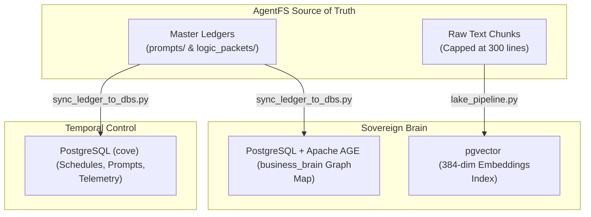

# Ingestion to Research Pipe: Consolidated Master Handoff Spec (The Murky Middle)

---
**Document Type:** handoff_compaction  
**Date:** 2026-06-30  
**Epistemic Grade:** FACT  
**Author:** Antigravity (Session b3c6cad8-d782-4797-9d9d-51ed1b80c200)  
**Target Audience:** Next Active AI Agent Instance (On Wake)  

---

## 1. Executive Summary & Foundational Vision

This document chronologically consolidates, cleans, and structures every detail, formula, decision, and philosophical foundation from the last 5 conversation sessions between Ewan Bramley (Strategic Architect) and Antigravity. It is designed to act as an un-diluted memory bridge, preventing critical engineering details from being lost in the "murky middle" of large context windows.

Ewan's core architectural vision is: **"Any resource that will be interpreted or used by AI is designed for AI."** 

This establishes a clean-room paradigm:
*   **The Python-Rust Partnership Metaphor:** The AI (the Python layer) is creative, probabilistic, and flexible, but prone to runtime drift. The harness (the Rust layer) is rigid, zero-compromise, and compiler-enforced, refusing to run any code that violates strict type, schema, or safety rules.
*   **Safety over Velocity:** Deterministic, compiled boundaries (static binaries stored in `/Users/ewansair/control-centre/bin/`) must wrap all AI interactions. The AI must never be allowed to edit its own rules, configurations, or gates (`.cursorrules`, `.clauderules`, `hooks.json`, `AGENTS.md`, `ESTATE-TAXONOMY.md`) in-flight.
*   **No Worktree, No Work:** Any mutation or code generation must execute in a strictly isolated git branch/worktree checkout, protecting the production workspace from dirty states.

---

## 2. Core Architecture: AgentFS & The Dual Database Sandbox

The Amplified Partners codebase abandons traditional heavy database architectures in favor of **AgentFS**, a content-addressable local filesystem database:

### A. The File is the Node
*   Every raw chunk, rule, or prompt is a self-contained, physical database node represented as a `.md` or `.txt` file.
*   **Schema Enforcement:** Every file has a **19-field Dual-YAML frontmatter header** specifying its coordinates, parent IDs, cryptographic witness, and scopes.
*   **Version Control as Transaction Log:** Git acts as the database transaction log, providing rollback capability, audit trails, and branching out-of-the-box.

### B. The Database is the Map, Not the Storage
*   The graph database (`amplified_brain` running Postgres + Apache AGE) does **not** house raw content payloads.
*   It functions strictly as a **cortex directory / registry map**, storing vertex coordinates (`file_hash_sha256`, `canonical_path`, `document_type`, `epistemic_tier`, `uuid`) and traversing edges (`RELATES_TO`) to return file coordinates. The executing agent resolves coordinates and reads raw text directly from the filesystem, keeping database connections sub-millisecond and lightweight.

### C. The Dual Database Sandbox
To isolate operational task flows from semantic business knowledge, the system enforces a strict division of database engines:
1.  **Orchestrator Database (`cove`):** A PostgreSQL instance strictly reserved for deterministic pipeline metadata, schedules, run logs, base system prompts, and Temporal worker state. It has a port mapping of `5433` (external) / `5432` (internal inside the container `cove-postgres` on Beast).
2.  **Semantic Memory Database (`amplified_brain`):** A PostgreSQL instance utilizing **Apache AGE** (graph traversal) and **pgvector** (similarity metrics) to store client knowledge maps and problem-solving primitives.
3.  **Local Analytical Lake ( DuckDB - `intelligence_lake.db` ):** Used inside development sandboxes for raw chunk staging, document lineage tracking, and Jaccard-similarity clustering.



---

## 3. The 25 Mathematical Spine Formulas & Parameters

To gate the probabilistic behaviors of the AI, the system runs a hard-coded **Mathematical Spine**. Below are the core equations and operational parameters preserved verbatim:

### A. Core Business Grammar

#### 1. The Profit Equation
Calculates the quadratic cash drag of operational errors and variance:
$$\text{Profit} = P - (C_d + L(\tau))$$
*   $P$: Amount Charged (utility-based pricing).
*   $C_d$: Direct delivery cost.
*   $L(\tau)$: Taguchi Quality Loss ($k_d \tau^2$) representing cost of errors, delays, and operational drift.

#### 2. The Product Success Condition
Determines the viability of a proposed product/market match:
$$\text{Success} = \text{Volume}(\text{Problem}) \times \text{Efficacy}(\text{Solution})$$
*   $\text{Volume}$ ($V$): Evaluated via Pointwise Mutual Information ($PMI$) for market Pain signal.
*   $\text{Efficacy}$ ($E$): Checked via Jaccard similarity ($J_{\text{set}}$) between solution steps and problem pain dimensions.
*   **Failsafe Gate:** Halt if $J_{\text{set}} < 0.25$.

#### 3. The Trust Invariant (`PRIM_TRUST`)
$$\text{Trust} = \text{Credibility (Do what you say)} + \text{Benevolence (Fair price)} + \text{Capability (Consistency)}$$
*   *Capability:* Inversely proportional to process execution variance.
*   *Benevolence:* Positive value exchange ($P < \text{Value Delivered}$).
*   *Credibility:* Evaluated by mapping outbound marketing promises against inbound git/system delivery logs.

#### 4. Disappointment Math
$$\text{Disappointment} = \max\left(0,\ \text{Promised} - \text{Delivered}\right)$$

### B. Statistical Ingestion & Gating Metrics

#### 5. Conformal Prediction Set Size
Guarantees set-valued bounds on output classifications:
$$\text{Set Size} \le 2 \quad (\text{Threshold to pass write gate})$$

#### 6. Semantic Entropy ($H_s$)
Measures token-distribution consensus over a Best-of-N reasoning loop ($N = 16$):
$$H_s < 0.4 \quad (\text{Threshold to pass write gate})$$

#### 7. Temporal Relevance Decay ($F15$)
Dictates when research inputs expire and must trigger automated loop re-runs:
$$R(t) = e^{-\lambda t}$$
*   $\lambda = 0.001$ (half-life of $693.0$ days): $5.6\%$ of research expired.
*   $\lambda = 0.002$ (half-life of $346.5$ days): $66.4\%$ of research expired.
*   $\lambda = 0.005$ (half-life of $138.6$ days): $77.6\%$ of research expired (standard trigger limit).

#### 8. Taguchi Quality Loss Function ($F12$)
$$L(\tau) = k_d \tau^2$$
*   $\tau$: Deviation ($y - T$) of the relevance score from the target centroid ($T = 2.0$).
*   *AI/ML Optimization ($k_d=0.50$):* Average loss is $0.40$.
*   *SMB Operations ($k_d=0.10$):* Average loss is $0.08$.
*   *Pure Mathematics ($k_d=0.001$):* Average loss is $0.0008$.

#### 9. Pudding Candidate Scoring ($F11$)
$$S = (\text{DomainDist} \times \text{PatternAlign}) + \text{GapComp} + \text{TensionBonus}$$
*   *Viable Threshold ($S \ge 13$):* $6.4\%$ of simulated paths passed.
*   *High Interest ($S \ge 18$):* $3.2\%$ of simulated paths passed.
*   *Exceptional ($S \ge 30$):* $0\%$ of simulated paths passed.

#### 10. Levenshtein Fuzzy Similarity
Used to block duplicate nodes and force spelling corrections at the input gate:
$$\text{Similarity}(A, B) = 1 - \frac{\text{Distance}(A, B)}{\max(\text{len}(A), \text{len}(B))}$$
*   **Fuzzy Target Gate:** Match is accepted if $\text{Similarity} \ge 0.80$ (Autocorrect is executed; below this, system halts to prevent guess-pollution).

#### 11. Resonance Amplitude Growth
Models un-attenuated feedback loop buildups in prompt cascades:
$$A(t) \propto t \cdot e^{\gamma t}$$
*   *Attenuation:* Tuned mass dampers (Temporal Decay, Taguchi Loss, and the Min-Rule) clamp growth.

#### 12. Amplified Estate Core Equation
$$\text{Amplified} = \text{Python-Rust Code} + \text{First Principles} + \text{Vellum} + \text{DB Structure} + \text{AI} + \text{Ewan}$$

#### 13. Queueing Theory Commitment Buffer
To absorb operational variance ($\sigma$), commitments must be bounded:
$$\text{Commitment Cap} = 80\% \text{ utilization} \quad (\text{reserves } 20\% \text{ as slack buffer})$$

### C. Hard Execution Constraints
*   **Vector dimension check:** pgvector columns must be strictly `384` dimensions (MiniLM standard).
*   **YAML Metadata Field Cap:** Standardized to `19` fields (limit range: $17\text{--}20$).
*   **Chunk size ceiling:** Tier-0 leaf slice must never exceed `300` lines of text.
*   **Preflight Backoff Limit:** If a deterministic pre-execution hook fails more than $N = 3$ times, the agent must halt execution, log state, and escalate to Linear. Undone is a valid state.
*   **AGENTS.md Length ceiling:** Must never exceed `500` lines.

---

## 4. Historical & Methodological Attributions

To ensure radical attribution, all system models are anchored to first-principles thinkers:
1.  **Karl Popper:** Science advances by falsification. The database logs structural gaps and ignorances to map what the system *does not* know.
2.  **Genichi Taguchi:** Quality loss function ($F12$). Deviation from target is a quadratic loss to the system.
3.  **Claude Shannon:** Information entropy ($H_s$). Measures uncertainty/diversity of token selections.
4.  **Don Swanson:** Literature-Based Discovery (LBD). The raw $A \rightarrow B \rightarrow C$ search loop linking disjoint domains.
5.  **Andrey Kolmogorov:** Complexity and dispersion bounds for context evaluation.
6.  **Keith Devlin:** The "Science of Patterns." Categorizing the Maths Spine into Numbers, Shapes, Motion, Logic, Chance, and Turing.
7.  **Edgar F. Codd:** Relational algebra. Applied set theory to end ad-hoc data layouts (1970).
8.  **Hans Peter Luhn:** Hashing. Invented hash tables to map words to fixed addresses due to scarce memory (1953).
9.  **Robert Cialdini:** Persuasion principles (Consistency, Reciprocity, Authority, Social Proof) mapped as causal rules in the psychology layer.
10. **Michael Gerber:** Systems. Repeatability primitives to model a business as a machine.
11. **Ray Dalio:** Radical Honesty, Transparency, and Risk Parity (The 5 Rods).
12. **Seth Godin:** Trust and permission-based value loops.
13. **Dan Kennedy:** Churn limits and unit economics pricing models.

---

## 5. The APQS Process Stack & Registry Hierarchy

We audit and organize SMB business processes using the **APQS** (Amplified Partners Quality System), aligned with the **APQC Process Classification Framework (PCF)**:

*   **Decomposition Range:** An average SME has **150 to 400** atomic processes.
*   **Decomposition Tiers:**
    *   *Tier 1 (Major Process Groups):* Cross-functional categories (e.g., Finance, Delivery, Acquisition).
    *   *Tier 2 (Core Processes):* End-to-end flows owned by a team.
    *   *Tier 3 (Sub-processes):* Logical divisions of Core Processes.
    *   *Tier 4 (Atomic Bricks):* The smallest repeatable units executed by AI at a $\ge 95\%$ confidence target.

### The 8 Starter Atomic Bricks:
1.  **Payment Matching:** Matching incoming bank feeds to open invoices.
2.  **Expense Categorisation & Approval:** Classifying expenses and routing for approval.
3.  **Customer Segmentation:** Grouping customers by behavioral/value metrics.
4.  **Reorder / Stock Trigger:** Setting stock alerts based on past usage patterns.
5.  **Invoice Generation & Dispatch:** Creating/sending invoices from delivery logs.
6.  **Basic Cash Flow Projection:** Forecasting cash positions (7-30 days) using Markov models.
7.  **KPI / Exception Reporting:** Flagging operational deviations.
8.  **Versioned Document Processing:** Ingesting and versioning files cleanly.

---

## 6. The "Arsewiper" Autocorrect Pipeline & Safety Nets

To catch errors before they contaminate database indexes or run hooks, the system runs a **4-level Autocorrecting Safety Net**:

```
[Raw Human/AI Input]
        │
        ▼
[Level 1: Input Autocorrect] ────► ewans_mouth.py (Linguistic tagging & Coordinate mapping)
        │
        ▼
[Level 2: Semantic Autocorrect] ──► search_autocorrect.py (Levenshtein fuzzy Snap-to-Center)
        │
        ▼
[Level 3: Format Guard] ─────────► shape_gate.py (Blocks YAML field count > 20 or missing fields)
        │
        ▼
[Level 4: Environment Gate] ─────► gatekeeper.py & code_syntax_gate.py (AST syntax repair & DB checks)
```

### Key Safety Scripts:
*   `ewans_mouth.py` (Intake Annotation Parser): Extracts and wraps raw speech in XML tags (`<certainty>`, `<ambiguity>`, `<metaphor>`, `<imprecision>`) and maps imprecise references to canonical names in `ESTATE-TAXONOMY.md`.
*   `search_autocorrect.py` (Spelling & Entity Alignment): Runs Levenshtein distance calculations against a static dictionary (`CANONICAL_VOCABULARY`). Corrects words like `Seth Golden` $\rightarrow$ `Seth Godin` and `cve` $\rightarrow$ `cove` if similarity $\ge 0.80$.
*   `code_syntax_gate.py` (Syntax Gatekeeper): Parses Python scripts via the `ast` module. Automatically fixes simple syntax errors (such as missing colons `:` at the end of block statements like `def`, `class`, `if`, `while`, `else`) to ensure code compiles before it runs.
*   `agentic_checks.py` (Deterministic Checks Harness): Programmatic CLI tool asserting git isolation, Postgres capability checks (AGE/pgvector extension validation), and vector dimension checks.

---

## 7. The Ingest-to-Research Watertight Pipeline

The automated research pipeline is secured from end-to-end to prevent probabilistic models from polluting the Sovereign Brain database:

```
[Temporal Execution Hook] 
       │ (Enforces pre-flight sandbox transaction verification)
       ▼
[Deterministic Harness (agentic_checks.py)]
       │ (Asserts branch isolation, pgvector dimensions, ast syntax)
       ▼
[Vellum Write Request (gate.py)]
       │ (Carries witness metadata: semantic_entropy, conformal_set_size, sandbox_verified)
       ▼
[Vellum API Boundary Check]
       │ (Fails and blocks the write if semantic_entropy >= 0.4 or conformal_set_size > 2)
       ▼
[Sovereign Brain (Postgres/AGE)]
```

*   **Sandbox Verification:** The write gate (`gate.py`) will reject any commit payload that does not carry `sandbox_verified = True`.
*   **The Self-Policing Contradiction Shield:** Validations must never be run by the generating AI. Verification is strictly offloaded to compiled, immutable Rust binaries (or isolated python AST checks) in `/Users/ewansair/control-centre/bin/`.

---

## 8. Chronological Chunk-by-Chunk Synthesis Log

This section details the specific conclusions, logic, formulas, and open items extracted from each of the 31 dialogue chunks:

### Chunks 01 - 05: Core Philosophy & Architecture Setups
*   **Chunk 01:** Goal of Deterministic Prompt and Rules Sync Pipeline. Defines AgentFS concept: the physical markdown file is the primary node, and the Postgres/AGE graph is a lightweight registry directory. 19-field Dual-YAML header ensures schema parity.
*   **Chunk 02:** Data sovereignty advantages of AgentFS. Defines the Division of Labor: AI handles probabilistic synthesis; Python/Rust handles deterministic validation and pre-flight checks. Introduces the Fractal/Scale-Free Database Schema: three tiers of metadata scale (Slice, Document, Pillar).
*   **Chunk 03:** Introduces the **Logic Sandwich** context retrieval schema: Doctrine/Rules (Constraints) on top, Subject Data (Facts) in the middle, and Recipes (Formulas) at the bottom. Defines the Local Graph cortex/neurons (Spotlight index + filesystem symlinks).
*   **Chunk 04:** Role of Apache AGE as the Hippocampus (Long-Term Memory). Defines three layers of cognitive lighting: Terminal ASCII pathway, Synaptic trail in Vellum, and Next.js visual dashboard (theater vs utility). Formulates self-tuning loops via Epistemic Promotion (INTUITED -> PROVEN) and Synaptic Plasticity.
*   **Chunk 05:** Hard lock-in of roles: Strategic Architect (Ewan), Genius Pattern Matcher (AI), and Binary Validator (Python/Rust). Separates mathematical tools from logical application rules. Registers the 30-60 degree isometric layout stack web application specs.

### Chunks 06 - 10: Deterministic Gates & Telemetry Integrations
*   **Chunk 06:** Prior Art Synthesis: "Any resource used by AI is designed for AI." Self-policing contradiction proof. Deployment of `agentic_checks.py` pathways (`--git`, `--db`, `--vector`, `--vibe`). Limits of AI-Native error diagnostics and backoff retry caps ($N = 3$) to prevent infinite correction loops.
*   **Chunk 07:** Explains the Python/Rust partnership and the Nested Gate Pipeline (the "escape room"). Conformance is binary. Defines "Job Done" (staged/committed in worktree) vs "Merged" (post-audit push).
*   **Chunk 08:** Resolution of the SearXNG port configuration error (Beast container binding missing) using SSH tunneling. Synthesizes parallel search findings validating pgvector+AGE, schema gating, XML prompt tagging, and the self-correction illusion.
*   **Chunk 09:** User approval of keeping previous taxonomy bracket formats `[cove]`, `[Beast]` for clarity with ignore comments for AIs. Schematizes the watertight temporal-to-vellum write validation pathway.
*   **Chunk 10:** Sandbox transaction hook verification logic. Maps database roles (`cove` = orchestrator, `amplified_brain` = semantic graph). Unified Operational Record requirements. Establishes read-only `ESTATE-TAXONOMY.md` compiled from Vellum logs. Standardizes the Spine Size Law (AGENTS.md ceiling of 500 lines).

### Chunks 11 - 15: Database Curation & Outbound Doorway
*   **Chunk 11:** Deterministic-First Law. All filesystem modifications must pass through a single outbound doorway (`outbound_doorway/`) as JSON patches. DB unique-constraint purge rule for the `ai_orientation_guide` table.
*   **Chunk 12:** Implemented `apply_doorway.py` and `cross_verify.py` inside `perplexity-inbox/harness/`. Rules synced to workspace. Defines Compiled Gate Law: safety gates must be compiled as Rust binaries in `/Users/ewansair/control-centre/bin/`.
*   **Chunk 13:** Created unified "On Wake" and "On Stop" lifecycle batons for Cursor (`/agents/cursor/BATON.md`) and Claude (`/agents/claude/BATON.md`). Deployed project-level `.cursorrules` and `.clauderules`.
*   **Chunk 14:** Config Mutation Guard Law implementation. Structured patches targeting protected files are rejected with a "Banned path" error. Deployed unit tests verifying guard status. Commits pushed on branch.
*   **Chunk 15:** Establishes initial state of Amplified Partners (0 clients, data anonymization at source). Bounded context target of 95% accuracy. Graph parameter scale targets (360 parameters, 5,000 to 20,000 nodes per process domain).

### Chunks 16 - 20: Process-Centric Graph Modeling & DuckDB Lake
*   **Chunk 16:** Rejects raw math labeling of queries. Formulates Topology-as-Language (graph structures serve as cross-client patterns). Reasoning Rubrics definitions. Forensically mining systems for operational truth (APQS / ISO 9001).
*   **Chunk 17:** Versioning-as-a-Feature (temporal graph depth). Cost and friction weighting on graph edges. Analytical layers (Markov, Game Theory) on graph. Cash flow domain schema nodes (`Customer`, `Invoice`, `Payment`, `Expense`).
*   **Chunk 18:** AI-native automation is process-specific. Deconstructs processes into reusable Reasoning Bricks. Lists 8 starter atomic bricks for SMEs. APQS process decomposition tier definitions.
*   **Chunk 19:** SME atomic process counts (typical: 150-400; target: 80-150). Process Register Schema. Integrated DuckDB analytical sandbox database (`intelligence_lake.db`) tracking document parent-child hash lineage.
*   **Chunk 20:** Aligns graph setup with APQC PCF benchmarking. Shift to problem-solving first-principles primitives (reasoning, math, logic, psychology). Implements Dual Database Sandbox (DuckDB context lake vs Postgres logic graph). Explores the Maths Spine (25 formulas).

### Chunks 21 - 25: Cialdini Psychology & LBD Calibrations
*   **Chunk 21:** Groups 25 formulas into Keith Devlin's six patterns of math. Multi-lens metaphors (Monocular, 3D dual-color, AI quad-color). Meta-Research loop. Dynamic logic extension candidates (FCM, FCA, Evidential Reasoning).
*   **Chunk 22:** Swanson LBD vs. Pudding axis framework. Evolving operational axes (Dimension, Logic, Math, Business). Content-Defined Chunking (CDC) history, CAS immutability, and EAV schema.
*   **Chunk 23:** First-principles math precedence (Luhn 1953, Codd 1970, Rabin 1981). Linux mdfind Spotlight architecture details. Python-Rust-Database workload delegation model. Metaphor of the Wind Tunnel and Database Laser.
*   **Chunk 24:** Company maturity friction tuning. Multi-lens projection properties. Calibrated the Maths Spine parameters via `calibrate_spine.py` on 125 research methods, writing `spine_calibration_results.json`.
*   **Chunk 25:** Verification results passing gatekeeper checks. Cursor rules propagation. Vellum ledger sync. Hard exclusions of hype-driven consultants ("flash bastards") in `glasses_registry.json`. Registration of first-principles canon thinkers (Gerber, Dalio, Godin, Kennedy).

### Chunks 26 - 31: Grammar Invariants & Immune Isolation
*   **Chunk 26:** Business grammar invariants (Profit, Success, Trust, Disappointment). Capacity-bounded commitments utilizing queueing theory buffers (80% utilization cap, 20% slack). Cialdini persuasion principles mapped to equations.
*   **Chunk 27:** EwansMouthParser annotation specifications. Linguistic Discourse Analysis taxonomy rules. Fuzzy target similarity check using Levenshtein distance. Semantic Neighborhood mapping (Voronoi cell).
*   **Chunk 28:** Four active levels of safety nets. CLI search autocorrect filter integration. Ast python code syntax linter colon auto-repair loop.
*   **Chunk 29:** Enforces the 0.95 certainty standard for input corrections. Closed directory constraint. Snout monologues crawler ingestion specifications. Spiking chronology. Dangers of over-engineering.
*   **Chunk 30:** Infrastructure freeze. Metaphor of the suspension bridge (balanced tension). Provenance metadata headers in YAML (`lbd_attribution`, `mathematical_provenance`, `provenance_sources`).
*   **Chunk 31:** Cognitive feedback loop resonance dampening. Decentralized Immune System (Tentacles isolation model). Pushes the final consolidated walkthrough and closes the session.

---
*Verified and compiled on Friday, June 19, 2026, under the active code branch: `task/sandbox-intelligence-lake`.*
---
