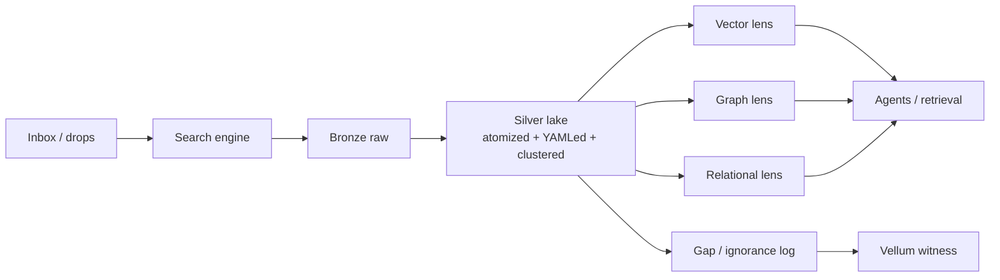

# Plan — Data lake pathway

**Plain summary:** Stop treating the brain as the first landing zone. Route **ingestion → search → data lake (Silver)**; graph and vector DBs are **lenses** built from labels at ingest, not the storage story.

---

## 1. Pathway change (one sentence)

**Old emphasis:** ingest → research pipe → brain write. **New emphasis:** ingest → search engine → **atomized/YAMLed Silver lake** → lens DBs (vector, graph, relational) derive schema from ingestion labels and gap events.

**Ratified constraints (today's baton):** Complete ingest→research→brain E2E smoke **before** filesystem reorg. Datalake = file taxonomy (Bronze/Silver/Gold), not Postgres-first.

---

## 2. Where data lakes live — options + recommendation

Prior art merged from: `prior-art-syntheses-bundle/data-lake-prior-art-synthesis__*__2026-06-25`, `RESEARCH-CAPTURE__ai-data-lake-structure__*`, web/SearXNG (Iceberg/Delta/on-prem ops), `intelligence-lake.mdc`, Beast inventory.

| Option | What it is | Pros | Cons | Fleet fit |
|--------|-----------|------|------|-----------|
| **A. Beast MinIO + Parquet + Iceberg** | Canonical lake on Hetzner; Bronze/Silver on object store; Iceberg catalog | Sovereignty; already on Beast; multi-engine; prior-art ratified; &lt;100GB Iceberg fast single-node | Needs platform ops (catalog, compaction); not Mac-local | **Recommended canonical** |
| **B. Mac shared drive (`~/amplified-pipeline/data/`)** | Seat-visible working + research JSONL witness | Human/agent shared path; stable mini principle (wanmin) | Mac read-only push; not durable archive; folder churn on M5 | **Working layer only** |
| **C. perplexity-inbox filesystem lake** | `chunks/`, `archive/`, DuckDB sandbox | SSOT for doctrine; 19-field YAML; `lake_pipeline.py` prototype | Not Beast-scale; local dev | **Dev + doctrine SSOT** |
| **D. Brain Postgres (pgvector + AGE)** | Production graph/vector | Live retrieval; 225K vectors today | **Lens, not lake** — violates assertion-context if used as dump | **Gold lens only** |
| **E. Cloud managed lakehouse** | Databricks / S3 Tables / Snowflake | Low ops | Sovereignty rod; cost; egress; architect estate is on-prem-first | **Demoted** |
| **F. Federated open nodes** | Planetary Swanson gap network (META §B) | Emergence signal across domains | No gap-event protocol; Merkle-CRDT infra only | **Phase 2 — after single-tenant lake** |

### Recommendation (for Ewan)

| Tier | Location | Role |
|------|----------|------|
| **Canonical lake** | Beast `/opt/amplified/` MinIO — Bronze raw, Silver atomized Parquet + Iceberg | Durable neutral storage |
| **Shared working** | `~/amplified-pipeline/data/` + `perplexity-inbox/` | Seat SSOT, research witness, batons |
| **Dev sandbox** | `perplexity-inbox/data/intelligence_lake.db` (DuckDB) | Lens logic prototype; pytest |
| **Lens DBs** | Beast `amplified_brain` (vector + AGE) | Projections from Silver — ephemeral Gold extraction |

**Not yet decided by architect:** Iceberg vs DuckLake (low-stakes — same Parquet files); vault Bronze/Silver triage on Beast.

---

## 3. Labeling at ingest → schema (graph + vector)

**Architect intuition:** Label at lake ingest → graph/vector schema becomes obvious.

| Stage | Label action | Schema output |
|-------|-------------|---------------|
| **Ingest gate** | 19-field Tier-2 YAML; `schema_code` via `glasses_loader.py`; taxonomy hit/miss | Atom identity + epistemic tier |
| **Gap event** | `metadata.gap_term`, `metadata.taxonomy_miss` → Vellum | `IgnoranceGap` node (unbuilt) |
| **Cluster pass** | Jaccard / GraphRAG Leiden on dimensions | `cluster_id`, community summaries |
| **Lens projection** | Canonical `chunk_id` + `chunk_hash_sha256` join | pgvector embedding; AGE entity/relation; DuckDB lineage |

**Prior art (labeling → KG):** SEDAR semantic labels at ingest (Tab2KG); DCPAC ontology catalog population; semantic data lake survey (ingestion-layer semantic labeling). Fleet-specific: gap-as-instrument (META) — **no published ingestion-taxonomy-miss standard**.

**Doctrine already encoded:** assertion-context boundary (`ai_native_data_organization.md` §6) — graph/vector hold assertions; filesystem WAL holds body text.

---

## 4. Open network vs single-tenant lake

| Model | When | Fleet stance |
|-------|------|--------------|
| **Single-tenant lake** | Now — one sovereign SMB estate | Build here first; gap log on Vellum + AGE |
| **Federated gap signals** | Later — planetary Swanson nodes | Merkle-CRDT + Flow P2P KG are infra candidates; **no gap-event schema** (RESEARCH-PIPE-RUN meta-layer §C2,C5 GAP) |

**Sequence:** Single-tenant Silver + gap instrument → export `IgnoranceGap` spec → optional federation.

---

## 5. Infrastructure checklist (Section A requirements)

| # | Item | Owner | Status |
|---|------|-------|--------|
| 1 | Beast MinIO Bronze/Silver buckets live | devin / beast | Partial — paths exist; Iceberg catalog unwired |
| 2 | Environment clean — worktree door, no M5 folder churn on mini | antigravity / ewan | wanmin stability principle; M5 churn ongoing |
| 3 | Shared drive — `~/amplified-pipeline/` seat folders + `data/research-pipe-docs/` | cursor | Exists; JSONL witness path used today |
| 4 | Python lake pipeline tested | cursor | `harness/lake_pipeline.py` + `test_lake_pipeline.py` — sandbox only |
| 5 | Rust doorway verified | cursor | `apply_doorway` on branch; merge pending |
| 6 | Mathematical spine calibrated | cursor | `calibrate_spine.py`, `PRIM_*` in lake DB — needs CI hook |
| 7 | `intelligence-lake.mdc` in repo SSOT | cursor | **Done** — `.cursor/rules/intelligence-lake.mdc` |
| 8 | Lens projection map (lake → brain) | cursor | **GAP** — P0 from research capture |
| 9 | Ingest→search→lake path wired (not brain-first) | devin | **GAP** — pathway change this plan |
| 10 | E2E pipe smoke before reorg | next seat | **Blocker** — baton priority |

---

## 6. Prior art — GAP UNRESOLVED

| Gap | Why it matters | Next action |
|-----|----------------|-------------|
| **Lens projection map unwired** | Silver Parquet → pgvector/AGE/DuckDB on shared IDs | P0 — cursor implements join spec |
| **Atom validity rubric** | "Non-nonsense" gate before Silver promotion | P0 — FD-inspired semantic unit test |
| **IgnoranceGap node + federated gap protocol** | Meta-layer instrument unbuilt | META §G.1–2; schema spec then Vellum hook |
| **Taguchi zone gate on gap-rate** | Safe/Distress/Critical on ingestion spikes | Fleet-native; no external spec |
| **Production Iceberg on Beast** | Prior art recommends; not live | Devin brief post architect ratification |
| **Cloud vs on-prem** | FinOps 2026: platform-engineering capacity binds SMBs | **Resolved for fleet:** on-prem Beast primary |
| **YAML "optimal" for AI** | Falsified as token-minimal (Section G capture) | Keep Tier-2 as scannable; not token-optimal |
| **Kaizen↔PUDDING graph edges** | Meta-layer symbiosis unimplemented | Graph ingest task |
| **Phoneme normalizer** | Secondary thread — after structure | Deprioritized per architect correction |

---

## 7. Architect decisions needed

1. **Ratify** Beast MinIO + Parquet + Iceberg as canonical lake (2026-06-25 synthesis — confirm or override).
2. **Ratify** medallion map: Bronze=raw, Silver=atomized/YAMLed, Gold=ephemeral brain extraction.
3. **Confirm** federated nodes = Phase 2 (not blocking lake build).
4. **Vault triage** on Beast — which `/opt/amplified/vault/` files are Bronze vs Silver.

---

[CLOSURE] branch=task/sandbox-intelligence-lake | inbox=PLAN__data-lake-pathway__v01__2026-06-30__cursor.md | tier=INTUITED
