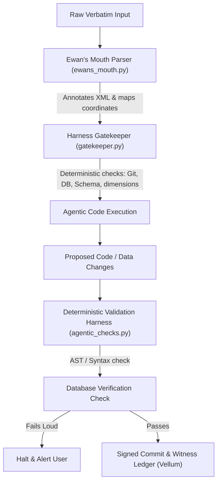

# Prior Art Synthesis: Deterministic Validation & AI-Native Data Structures in Agentic Workflows

**Date:** 2026-06-30  
**Epistemic Tier:** FACT  
**Author:** Antigravity  
**Target Topic:** Checks and measures using deterministic methods in supporting agentic flows.  

---

## 1. Executive Summary & Ewan's Vision

We have synthesized the prior art retrieved from the Beast's SearXNG/Perplexity loop along with global developer guidelines. The findings validate the architect's core thesis: **"Any resource that will be interpreted or used by AI is designed for AI."**

Rather than relying on human-centric data structures (JSON, CSV, verbose text) and probabilistic self-policing (where an LLM reviews its own work, creating a logical self-contradiction), enterprise-grade agentic infrastructure requires:
1.  **AI-Native Data Representation:** Data models engineered for token efficiency, semantic density, and vector-graph adjacency (e.g., Apache Arrow, Lance, TOON format).
2.  **Linguistic Annotation (Ewan's Mouth):** Programmatic ingestion pipelines that wrap raw verbatim human input in XML schema tags (`<certainty>`, `<ambiguity>`, `<metaphor>`, `<imprecision>`) and map them directly to canonical coordinates, optimized for LLM prompt caching.
3.  **Strict Deterministic Gates:** Non-probabilistic execution checkers (syntax linters, git clean room assertions, database constraints, schema matching) that force fail-loud compilation of agent outputs.
4.  **Tri-Council Auditor consensus:** When deterministic logic is mathematically impossible, validation is offloaded to a three-model consensus loop running across distinct API instances, avoiding single-model echo chambers.

---

## 2. Core Prior Art & Industry Paradigms

### A. The Self-Policing Contradiction (Single LLM Bias)
*   **The Problem:** Asking a probabilistic LLM to rate its own confidence or self-police its own hallucinations is a mathematical failure pattern. The model cannot diagnose its own ignorance because the same weights that produced the error are used to evaluate it.
*   **Prior Art Remedy:** Industry leaders (Patronus AI, MindStudio) enforce a strict separation of concerns. The agent generates, but the **Validator** is an entirely separate node. This validator is either 100% deterministic (unit tests, AST compilers, regex patterns, regex-based schema parsers) or uses an independent consensus panel of multiple different models.

### B. AI-Native Schema & Data Representation
*   **Human-to-Machine Gap:** JSON, CSV, and YAML are optimized for human developer reading. They consume significant token budgets and introduce syntax noise.
*   **Designed-for-AI Formats:**
    *   **Lance & Arrow:** Re-engineering the database storage format to optimize vector-graph calculations and handle raw unstructured chunks with zero overhead.
    *   **TOON (Token-Optimized Object Notation):** Structured formatting that prioritizes semantic relations and logic paths over developer-friendly layout spacing.
    *   **Kolmogorov/PUDDING Metadata:** Restricting knowledge-base categorization to strict logical schema hierarchies (`WHAT.HOW.SCALE.TIME`) rather than ad-hoc natural language search fields.

### C. Discourse Annotation & XML Tagging
*   **Linguistic Discourse Analysis (XML Boundaries):** Standard prompting best practices (supported by Anthropic and ArXiv research) prove that wrapping inputs in semantic XML tags (e.g., `<instructions>`, `<taxonomy>`, `<input>`) dramatically increases accuracy.
*   **Verbatim Parsing:** Processing conversational inputs to identify and tag uncertainty and metaphorical statements (e.g., "triangle," "hole," "vibe") prevents the LLM from executing on imprecision. The parser converts colloquial targets to exact coordinate mappings (e.g. mapping "cove database" directly to `postgresql://cove...`).

---

## 3. Reference Architecture for Deterministic Gates

---

## 4. File Registry

All research data, scripts, and logs are saved at the following coordinates:
*   **Raw Search Results JSON:** [checks-and-measures-using-deterministic__2026-06-30.json](file:///Users/ewansair/ingestion-to-research-pipe/perplexity-inbox/raw_searches/checks-and-measures-using-deterministic__2026-06-30.json)
*   **Synthesis Document (This File):** [synthesis__deterministic_agent_validation__2026-06-30.md](file:///Users/ewansair/ingestion-to-research-pipe/perplexity-inbox/raw_searches/synthesis__deterministic_agent_validation__2026-06-30.md)
*   **Interactive Target Gate:** [term_gate.py](file:///Users/ewansair/ingestion-to-research-pipe/perplexity-inbox/harness/term_gate.py)
*   **Intake Annotation Parser:** [ewans_mouth.py](file:///Users/ewansair/ingestion-to-research-pipe/perplexity-inbox/harness/ewans_mouth.py)
*   **Deterministic Checks Harness:** [agentic_checks.py](file:///Users/ewansair/ingestion-to-research-pipe/perplexity-inbox/harness/agentic_checks.py)
