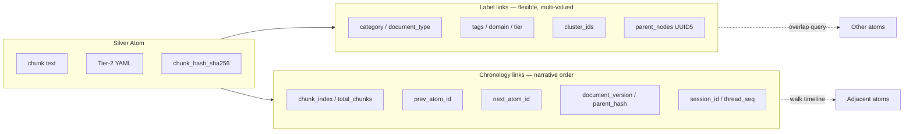

# Thread Extraction — Atom Ideal Spec (Label + Chronology Linking)

**Purpose:** Re-process thread `0e0bd954` into 8 logical chunks; extract all valuable data, conclusions, and research; draft **atom ideal spec** where atoms (lake chunks) link primarily by **labeling + chronology** — flexible, not rigid schema. Includes prior art pass not fully captured in earlier runs.

---

## Executive synthesis (10 bullets max)

1. **Primary thesis (corrected):** Classic DB math (Codd/Armstrong/Bernstein) = logic base → mutate for AI → neutral lake (atomized + clustered + YAMLed) → lens DBs (vector/graph/relational) as projections, not homogenized copies.
2. **Atom definition emerging:** An atom is a **non-nonsense semantic chunk** at Silver layer; size bounded by token/line heuristics; identity via content hash + stable ID; **links are label + chronology**, not rigid relational joins.
3. **Label linking:** Taxonomy categories (`doctrine/`, `research/`, …), `document_type`, `epistemic_tier`, domain tags, cluster membership — multi-valued, schema-on-read; organization is organization (neutral, multi-purpose).
4. **Chronology linking:** `date`, `chunk_index`/`total_chunks`, `prev_atom`/`next_atom`, `created_at`, document version lineage (`parent_hash`), session/thread ordering — enables narrative reconstruction without forcing FK graph.
5. **Imagineering falsification:** Codd-as-logic-base and atomized-chunks-as-unit = **SOLID**; YAML-optimal = **WEAK** (reframe as scannable Tier-2); clustering vs medallion = complementary not either/or; lake+lens wiring = **GAP**.
6. **Secondary thread (deprioritized):** Phoneme/grapheme deterministic normalizer at 3 touchpoints (audio→text, ingest, search); dual-stream Bronze verbatim + Silver normalized keys resolves Verbatim Acoustic Intake Valve tension.
7. **Internal encoding partial:** 19-field YAML, chunks taxonomy, `lake_pipeline.py` DuckDB prototype, `search_autocorrect.py` (grapheme only), Vellum append-only hash chain — **no atom validity rubric, no label+chronology link spec, no lens projection map**.
8. **Prior art for label+chronology:** Event sourcing, append-only ledgers, bi-temporal KG, RDF-star/reification, tag-based metadata, RFC 4287 Atom syndication (name collision only), content-addressed IDs (IPFS/CID pattern ≈ fleet BLAKE3/SHA-256).
9. **Architect critical insight (final message):** Atoms idealized as flexible chunks linked by **labeling + chronology** — explicitly **not** rigid schema; this supersedes over-normalized 19-field-as-only-link model for v2.
10. **Pass 2 atoms-first:** Atom validity rubric → label taxonomy v1 → chronology field spec → Codd→AI mapping → lens projection map → cluster algorithm eval → phoneme layer (secondary).

---

## Atom ideal spec draft

### What we know (INTUITED — architect + thread + internal encoding)

| Dimension | Spec draft | Evidence |
|-----------|------------|----------|
| **Unit** | Atom = Silver-layer chunk file (`.txt` + Tier-2 YAML header + optional `.vector` sidecar) | Architect "atomized"; `chunks/README.md`; `ai_native_data_organization.md` §3 |
| **Size heuristics** | Target **800–1500 tokens** (~250–550 words) for analysis/RAG; hard cap **~300 lines**; split at paragraph/semantic boundary, not byte boundary | `intelligence-lake.mdc`; `lake_pipeline.py`; thread chunking this session |
| **Non-nonsense gate** | Atom must carry single coherent semantic unit; reject orphan pronouns, empty headers, pure metadata shells | Architect verbatim; **GAP** — no rubric encoded |
| **Identity** | `atom_id` (UUID or deterministic slug); `chunk_hash_sha256`; optional `content_cid` (BLAKE3 from prior-art bundle) | 19-field schema fields 12–13; medallion synthesis |
| **Label taxonomy (v1)** | **Primary labels:** `category` (doctrine/rules/research/…), `document_type`, `epistemic_tier`, `domain`, `author`/`seat`, `client_scope`, `project_scope` | `chunks/README.md` §1–2; 19-field Blocks A/E |
| **Label taxonomy (v2 — flexible)** | Multi-valued `tags[]`, `cluster_ids[]`, `reasoning_primitive_ids[]`, `parent_nodes[]` (graph symlinks) — **no single mandatory join table** | Architect "flexible not rigid"; `lake_pipeline.py` chunk_clusters |
| **Chronology fields** | `date` (calendar); `created_at` (UTC ingest); `chunk_index` + `total_chunks`; `prev_atom_id` + `next_atom_id`; `document_version` + `parent_hash`; optional `session_id` + `thread_seq` | `extract_and_chunk.py` L106–116; `documents` table in lake_pipeline |
| **Link model** | **Primary:** label overlap (shared tags/category/domain) + chronology adjacency (prev/next, same document, same session timeline). **Secondary:** cluster similarity, graph `parent_nodes`, content hash dedup. **Not required:** rigid FK schema across all atoms | Architect final message; falsification WEAK on polyglot ops cost |
| **Clustering** | Semantic clusters (GraphRAG Leiden / Jaccard dimensions) sit **above** atoms; do not merge atom content | Architect "clustered how AI would prefer"; RESEARCH-CAPTURE §C.2 |
| **YAML Tier-2** | 19-field sovereign seal + v2 extensions; field order stable for prompt caching; human-scannable Tier-1 parallel | `ai_native_data_organization.md`; falsification: YAML not token-minimal |
| **Bronze/Silver split** | Bronze = append-only raw (verbatim transcript, original drop); Silver = atomized+labeled+YAMLed; chronology links both via `source_atom_bronze_id` | Dual-stream from phoneme capture; Verbatim Acoustic Intake Valve |

### GAP (needs research / encode)

| Gap | Priority |
|-----|----------|
| Atom validity rubric (FD-inspired: single subject, min information content) | **P0** |
| Label taxonomy canonical registry (merge `chunks/` categories + ESTATE-TAXONOMY + 19-field enums) | **P0** |
| Chronology link spec doc (prev/next vs bitemporal valid-time — which fields mandatory) | **P0** |
| `prev_atom_id` / `next_atom_id` in 19-field schema v2 | **P1** |
| Label-only retrieval path (Spotlight/`mdfind` tags + SQLite index in `search_chunks.py`) without full graph | **P1** |
| Bi-temporal validity for architect speech sessions (valid-time vs transaction-time) | **P2** |
| Phoneme spine fields on Silver atoms (secondary) | **P2** |

### Link model diagram

---

## Chunk-by-chunk extractions

### Chunk A — Primary thesis (DB structure, lake, lenses)

**Source:** Thread lines 1–2 (opening architect query); priority correction L33–35; subagent 7811b0cf.

| Type | Extraction | STATUS |
|------|------------|--------|
| **Architect intent** | Old-school DB maths (50s–90s) as **logic base**, not blueprint — blend with AI-specific construction | needs research (Codd→AI bridge doc) |
| **Architect intent** | Data lake = neutral storage; multiple DBs flow from lake **without homogenization** | partially encoded |
| **Architect intent** | Organization is organization — neutral, multi-purpose | partially encoded (`chunks/` taxonomy) |
| **Architect intent (corrected)** | Lake file structure: **atomized + clustered + YAMLed**; DBs on top = **lenses** | partially encoded |
| **Conclusion** | Two goals were conflated; **DB structure PRIMARY**, phoneme SECONDARY | encoded (priority correction in captures) |
| **Citation** | Codd 1970–1977, Armstrong 1974, Bernstein 1976, Dixon 2010, Armbrust 2021, property-graph 3NF 2025 | needs research (mapping doc) |
| **Internal** | `RESEARCH-CAPTURE__ai-data-lake-structure__*` written; mermaid Classic→Lake→Lens | encoded |

---

### Chunk B — Atomization + chunk size + YAML/clustering

**Source:** Thread L1 atomization quote; architect L33 lake properties; RESEARCH-CAPTURE §C; `intelligence-lake.mdc`.

| Type | Extraction | STATUS |
|------|------------|--------|
| **Architect intent** | Atomization = each part **non-nonsense**; nonsense atoms useless | needs research (validity rubric) |
| **Architect intent** | Chunk size = atom size for lake | partially encoded (~300 lines, 250–550 words) |
| **Architect intent** | Clustered = how AI prefers grouping (not homogenized) | partially encoded (`lake_pipeline.py` Jaccard) |
| **Architect intent** | YAMLed = formatted as AI would like to read | partially encoded (19-field Tier-2) |
| **Fact** | Late chunking (arxiv 2409.04701) — embed whole doc then chunk | needs research (eval) |
| **Fact** | Parent-child retriever (Small-to-Big) — small retrieval unit + large context | GAP — not encoded |
| **Fact** | Hierarchical RAG chunking (arxiv 2507.09935) | needs research |
| **Conclusion** | Atom size correct in principle; **calibration + validity gate** missing | GAP |
| **Conclusion** | Clustering complements medallion tiers, does not replace | encoded (falsification §G) |

---

### Chunk C — Label + chronology linking model (NEW emphasis)

**Source:** Architect final message L42; `extract_and_chunk.py`; `chunks/README.md`; this session SearXNG prior art.

| Type | Extraction | STATUS |
|------|------------|--------|
| **Architect intent** | Atoms linked by **labeling + chronology** — **flexible, not rigid schema** | **needs research** (spec doc) |
| **Architect intent** | Idealizing atoms = idealizing chunk size for data lake | INTUITED (this extraction) |
| **Internal** | `extract_and_chunk.py` writes `previous_chunk` / `next_chunk` in YAML header | partially encoded (script exists, not in 19-field SSOT) |
| **Internal** | `chunks/` category folders = label dimension | encoded |
| **Internal** | 19-field: `date`, `chunk_index`, `total_chunks`, `parent_nodes` — chronology + graph labels | partially encoded (missing prev/next atom IDs) |
| **Internal** | Vellum = append-only hash-chained ledger; chronology via entry ordering | encoded (fleet) |
| **Internal** | `documents.parent_hash` + `version` = document-level chronology | encoded (`lake_pipeline.py`) |
| **Prior art** | Event sourcing — immutable event log, reconstruct state from chronology | cited (Azure pattern) |
| **Prior art** | Bi-temporal KG / valid-time + transaction-time (MDPI 2025; Sentra bitemporal article) | needs research |
| **Prior art** | Tag-based metadata > rigid hierarchy for flexible org (PKMS literature) | cited |
| **Prior art** | RDF-star / reification — metadata about statements without collapsing atoms | cited (Ontotext, W3C) |
| **Prior art** | Content-addressed IDs (IPFS CID ≈ BLAKE3/SHA-256 identity) | partially encoded |
| **Conclusion** | **Primary link model for v2:** multi-valued labels + chronology chain; 19-field is coordinates, not sole join key | INTUITED — architect-aligned |

---

### Chunk D — Falsification findings (SOLID/WEAK/GAP)

**Source:** Architect L37–40 imagineering; RESEARCH-CAPTURE §G; subagent ec780d6a.

| Claim | Verdict | Action |
|-------|---------|--------|
| Codd normal forms = valid logic base for AI storage | **SOLID** | Keep as informing FD→atom boundaries |
| YAML optimal for AI read/write | **WEAK** | Reframe: scannable Tier-2, not token-minimal |
| Atomized chunks = correct retrieval unit | **SOLID** (+ rubric GAP) | Build validity rubric |
| AI clustering beats medallion tiering | **WEAK** | Use both — medallion storage + semantic clusters |
| Lens DBs avoid homogenization | **WEAK** | Sound metaphor; govern polyglot ops cost |
| Lake + lens separation architecturally sound | **GAP** | Literature supports; fleet wiring absent |

**Architect meta:** Imagineering = prism search to disprove foundations before building. Encoded in capture §G.

---

### Chunk E — Phoneme secondary thread + 3 touchpoints

**Source:** Thread L8–18; RESEARCH-CAPTURE phoneme; RESEARCH-PIPE-RUN.

| Type | Extraction | STATUS |
|------|------------|--------|
| **Architect intent** | Phoneme = sounds; accents in transcription (STT: phemone/Beemones) | needs research |
| **Architect intent** | Same deterministic normalizer at **audio→text, ingest→lake, query→search** | needs research |
| **Architect intent** | Guard byte-dedup led astray by fat fingers / poor spelling | partially encoded (Levenshtein only) |
| **Architect intent** | Real-time audio→transcription reduces token cascade | needs research |
| **Architect intent** | Internal failure-pattern corpus sufficient for algorithmic fix | GAP (corpus not inventoried) |
| **Architect intent** | NOT Russian maths interpretation — no corrupting natural language | needs research (dual-stream) |
| **Tension** | Verbatim Acoustic Intake Valve vs phoneme canonicalization | partially encoded (dual-stream proposed) |
| **Recommendation** | Bronze verbatim immutable + Silver normalized + phonetic keys; LLM above normalizer | INTUITED — not ratified |
| **Survivors** | WFST G2P W12-6208, Mlphon, Double Metaphone, NeMo ITN, EDC, FastCorrect | cited in phoneme capture |

---

### Chunk F — Prior art internal (search_autocorrect, verbatim valve, 19-field)

**Source:** Subagents 1f9920af, bd35d2c9; internal grep.

| Path | Covers | Gap |
|------|--------|-----|
| `harness/search_autocorrect.py` | Levenshtein + alias map at query time | No phonetic keys |
| `docs/ai_native_data_organization.md` | 19-field atom schema; assertion-context boundary; ingestion gate | No prev/next atom; no label registry |
| `chunks/README.md` | Filesystem taxonomy; YAML headers; Spotlight tags | Category labels only; no chronology spec |
| `harness/lake_pipeline.py` | DuckDB documents/chunks/clusters/primitives | Local prototype; no Silver Parquet |
| `scripts/extract_and_chunk.py` | prev/next chunk chronology in YAML | Not wired to inbox watcher |
| `overallpicture1` chunks | Verbatim Acoustic Intake Valve doctrine | Bronze/Silver not ratified |
| `.cursor/rules/intelligence-lake.mdc` | DuckDB schema + reasoning primitives | Encoded (self-compound session) |
| `prior-art-syntheses-bundle/data-lake-*` | Medallion, BLAKE3, GraphRAG loop | Cite only |

---

### Chunk G — External academic survivors (Codd, WFST, EDC, etc.)

**Source:** SearXNG passes 7a3e928f, 7811b0cf; OpenAlex; RESEARCH-CAPTURE sections B–D.

| Domain | Key survivor | Relevance to atoms |
|--------|--------------|-------------------|
| Relational NF | Codd 1970–1977, Bernstein 1976, Armstrong 1974 | FD → atom field constraints; decomposition → split rules |
| Property-graph NF | doi:10.1007/s00778-025-00902-2 | Graph lens atom normal form |
| RAG chunking | arxiv 2409.04701 (late chunking), 2407.21059 (Modular RAG) | Atom size calibration |
| GraphRAG | arxiv 2501.00309, Edge 2024 | Cluster layer over atoms |
| Lake/lens | VLDB P1372 Active Data Lakes | Lens abstraction over neutral lake |
| Polyglot | PDDM W3118609515 | Formal lens projection method |
| Phonetic (secondary) | W12-6208, Double Metaphone, doi:10.1145/3377455 blocking | Silver atom join keys |
| Entity canon | EDC EMNLP 2024 | Text atom → graph projection |
| **Label+chronology (this pass)** | Event sourcing (MS Azure); bi-temporal RDF (MDPI 2025); RDF-star (Ontotext); tag-based metadata (JYU PDF) | Link model prior art |

**Demoted:** GeeksforGeeks, YouTube, Reddit, generic Medium lake guides.

---

### Chunk H — Pass 2 research queue + open gaps

**Merged from both captures + this extraction. Atoms first.**

| P | Item | Blocks |
|---|------|--------|
| **P0** | **Atom ideal spec v1 ratification** — label taxonomy + chronology fields + link model (this doc §Atom spec) | All lake work |
| **P0** | **Atom validity rubric** — non-nonsense gate before Silver promotion | Atomized property |
| **P0** | **Label taxonomy registry** — canonical enums + multi-valued tags; merge chunks/ + 19-field | Label linking |
| **P0** | **Chronology field spec** — mandatory vs optional; prev/next vs bitemporal | Chronology linking |
| **P0** | **Codd→AI atom mapping doc** — FDs → field constraints; Bernstein → split rules | Logic base |
| **P0** | **Lens projection map** — canonical IDs lake → vector/graph/relational | Multi-DB |
| **P1** | **19-field schema v2** — add `prev_atom_id`, `next_atom_id`, `tags[]`, `cluster_ids[]`, `bronze_source_id`, `atom_validity_score` | YAML + links |
| **P1** | Wire `extract_and_chunk.py` chronology pattern into `inbox_watcher.py` / Silver promotion | Ingest |
| **P1** | Cluster algorithm eval — taxonomy vs GraphRAG Leiden vs embedding | Clustered property |
| **P1** | Parent-child chunk pattern + late chunking eval | Size calibration |
| **P2** | Bi-temporal validity for session/thread atoms | Advanced chronology |
| **P2** | YAML vs JSON Schema vs TOON token efficiency | Tier-2 format |
| **P2** | Property-graph 3NF on AGE atoms | Graph lens |
| — | *(Secondary)* Phoneme normalizer, dual-stream, failure corpus inventory | See phoneme capture §E |

---

## Prior art: label + chronology atom linking

**Method:** SearXNG wide→narrow→wide (17 queries) + OpenAlex (5) + internal grep. Epistemic tier: INTUITED.

### SearXNG survivors

| ID | Topic | Survivor | URL | Relevance |
|----|-------|----------|-----|-----------|
| L1 | Temporal KG | ATOM: AdapTive temporal KG (EACL 2026 findings) | https://aclanthology.org/2026.findings-eacl.49/ | Temporal metadata on graph atoms |
| L2 | Bi-temporal | What Is a Bi-Temporal Knowledge Graph? | https://www.sentra.app/articles/what-is-a-bitemporal-knowledge-graph | valid-time + transaction-time on links |
| L3 | Append-only | SQL Server append-only ledger | https://learn.microsoft.com/en-us/sql/relational-databases/security/ledger/ledger-append-only-ledger | Immutable chronology log pattern |
| L4 | Event sourcing | Azure Event Sourcing pattern | https://learn.microsoft.com/en-us/azure/architecture/patterns/event-sourcing | State from ordered events ≈ atom chronology walk |
| L5 | Content-addressed | IPFS Content Addressing / CIDs | https://docs.ipfs.tech/concepts/content-addressing/ | Hash identity ≈ fleet chunk_hash |
| L6 | RDF metadata | RDF-star (Ontotext) | https://www.ontotext.com/knowledgehub/fundamentals/what-is-rdf-star/ | Statement-about-statement without reification bloat |
| L7 | Reification | Metadata about RDF triples (Jeni Tennison 2008) | http://www.jenitennison.com/2008/04/11/metadata-about-rdf-triples-reification-and-linked-data.html | Provenance on links |
| L8 | Tag-based org | Tag-Based Metadata Management (JYU PDF) | https://users.jyu.fi/~miettine/kurssit/jatkoksem/miika11112010.pdf | Flexible labels vs rigid schema |
| L9 | Tag vs hierarchy | Designing file organization around tags (2017) | https://lobste.rs/s/hv7alh/designing_better_file_organization | Supports architect flexible linking |
| L10 | Atom syndication | RFC 4287 Atom format | https://www.ietf.org/rfc/rfc4287.txt | Name collision only — feed chronology idiom |

### OpenAlex survivors (label+chronology pass)

| Query | Survivor | DOI |
|-------|----------|-----|
| RDF reification provenance | Benchmarking RDF Metadata Representations (2021) | doi:10.1109/icsc50631.2021.00049 |
| Content-addressed | A scalable content-addressable network (2001) | doi:10.1145/383059.383072 |
| Event log | Discovering models from event-based data (1998) | doi:10.1145/287000.287001 |

### Internal prior art (not in external pass)

| Asset | Label+chronology contribution |
|-------|--------------------------------|
| **Vellum ledger** | Append-only hash-chained entries; chronological witness; attributed rows |
| **`extract_and_chunk.py`** | `previous_chunk` / `next_chunk` in YAML — **proto chronology spec** |
| **`chunks/README.md`** | Category labels + `chunk_index` in YAML |
| **`lake_pipeline.py`** | `documents.version` + `parent_hash`; `chunks.chunk_index` |
| **`harness/calibrate_spine.py`** | PRIM_DECAY temporal relevance — chronology in scoring layer |
| **META-LAYER gap detection** | Temporal cluster query on IgnoranceGap nodes — chronology across nodes |

### Synthesis: how prior art maps to architect model

| Architect choice | Prior art support | Verdict |
|------------------|-------------------|---------|
| Label-based flexible linking | Tag metadata literature; filesystem taxonomy; multi-valued Spotlight tags | **SOLID** |
| Chronology-based linking | Event sourcing; append-only ledgers; prev/next chains; bi-temporal KG | **SOLID** |
| Content-addressed atom identity | IPFS CID; CAN papers; fleet BLAKE3/SHA-256 | **SOLID** |
| Rigid 19-field as only join key | Over-normalization tension; architect explicitly rejected rigid schema | **WEAK** — keep as Tier-2 coordinates |
| Full bi-temporal on every atom | Academic support exists; fleet complexity high | **GAP** — start with prev/next + created_at |

---

## Master conclusion list (deduplicated)

1. Classic DB theory informs atom **logic**; AI construction mutates implementation (atomized, clustered, YAMLed lake + lens DBs).
2. **Atom = non-nonsense Silver chunk** with bounded size (~800–1500 tokens analysis target; ~300 line cap).
3. **Primary link model = labeling + chronology** — flexible, multi-valued; not rigid relational schema (architect final insight).
4. 19-field YAML = Tier-2 **coordinates** (identity, hashes, scopes); extend with `prev_atom_id`, `next_atom_id`, `tags[]`.
5. Clustering groups atoms for retrieval; does not merge content or replace medallion tiers.
6. Lens DBs (vector, graph, relational) project from neutral lake on canonical IDs — **GAP: not wired**.
7. Imagineering falsification validates foundations: Codd + atomized chunks SOLID; YAML-optimal WEAK; lake+lens wiring GAP.
8. Phoneme normalizer is **secondary** — dual-stream Bronze/Silver resolves verbatim vs canonical tension.
9. Internal proto-chronology exists (`extract_and_chunk.py`); not promoted to inbox SSOT or 19-field schema.
10. Vellum append-only hash chain is fleet chronology witness — align atom `created_at` + ledger row causation.
11. Prior art supports label+chronology over rigid schema (event sourcing, tag metadata, RDF-star, bi-temporal KG).
12. **P0 next:** atom validity rubric + label registry + chronology spec + Codd→AI mapping — before phoneme layer.

---

## Pass 2 queue (updated — atoms first)

See Chunk H table above. Top 5 for architect visibility:

1. Ratify **atom ideal spec v1** (this document §Atom spec draft)
2. Build **atom validity rubric** (non-nonsense gate)
3. Publish **label taxonomy registry** v1
4. Publish **chronology field spec** (mandatory fields + prev/next pattern)
5. Write **Codd→AI atom mapping** (1 page)

Phoneme normalizer remains P1/P2 in phoneme capture — do not lead Pass 2.

---

*Author: cursor · Epistemic tier: INTUITED · Chunks analyzed: 8 · Thread: 0e0bd954 · 2026-06-30*
