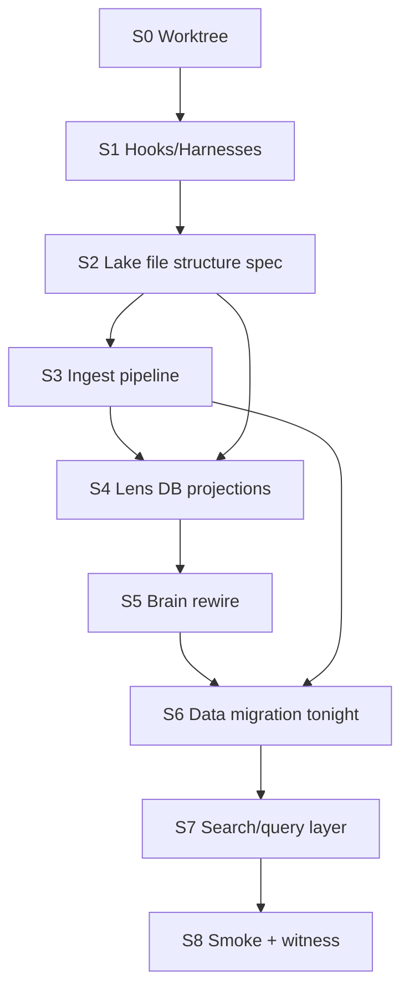

# Handoff — Research Folder → Full Implementation Plan

**Use this document as the operating brief for a NEW Cursor instance.** Your job is **planning only** — synthesize the research folder into a start-to-finish implementation plan with external verification on every major claim. Do **not** implement code in the planning session unless the architect explicitly escalates to execution after plan ratification.

---

## A. Mission statement

Synthesize **all** material in `perplexity-inbox/research-datalake-db-30-06-2026/` — primary thread chunks A–H, multi-seat harvest chunks (01a2ab34, 11410e93, cf0da9b0, antigravity-agentfs, chunk-I), master captures, SYNTHESIS-PREP, and partner source-context files — into a single **verified, dependency-ordered implementation plan** for Amplified Partners' sandbox intelligence lake architecture: **classic DB logic base → AI-mutated neutral lake (atomized + clustered + YAMLed) → lens DB projections** (DuckDB sandbox, pgvector/AGE Brain, relational views), with atoms linked primarily by **labeling + chronology** (800–1500 tokens, ~300 line cap). Phoneme normalization is **secondary** (P1/P2, three touchpoints). **Tonight's priority:** database data migration + Brain back-ingestion rewire (Brain becomes easier once lake-first architecture lands). Every major architectural claim must survive an external falsification pass (SearXNG wide→narrow→wide, OpenAlex where academic, adversarial demote) before the plan proceeds to staged execution mapping. Output: a plan artefact the fleet can execute via worktrees, hooks/harnesses, and multi-agent delegation (Composer subagents where remit is independent).

---

## B. Required reading list

Read **in this order** before writing the plan. Each chunk file has a paired `partner-*__source-context.md` — read both.

### B.1 — Folder index and synthesis prep (mandatory first)

| Priority | Path |
|----------|------|
| P0 | `perplexity-inbox/research-datalake-db-30-06-2026/README.md` |
| P0 | `perplexity-inbox/research-datalake-db-30-06-2026/SYNTHESIS-PREP__multi-seat-chunk-index__2026-06-30__cursor.md` |
| P0 | `perplexity-inbox/research-datalake-db-30-06-2026/INDEX__THREAD-EXTRACTION__atom-chunk-label-chronology__v01__2026-06-30__cursor.md` |

### B.2 — Primary thread (0e0bd954) — chunks A–H + partners

| Chunk | File | Partner |
|-------|------|---------|
| A | `chunk-A__primary-thesis-db-lake-lenses.md` | `partner-A__source-context.md` |
| B | `chunk-B__atomization-chunk-size-yaml-clustering.md` | `partner-B__source-context.md` |
| C | `chunk-C__label-chronology-linking-model.md` | `partner-C__source-context.md` |
| D | `chunk-D__falsification-findings.md` | `partner-D__source-context.md` |
| E | `chunk-E__phoneme-secondary-thread.md` | `partner-E__source-context.md` |
| F | `chunk-F__prior-art-internal.md` | `partner-F__source-context.md` |
| G | `chunk-G__external-academic-survivors.md` | `partner-G__source-context.md` |
| H | `chunk-H__pass2-research-queue.md` | `partner-H__source-context.md` |

### B.3 — Master captures (full read; Section G is falsification SSOT)

| File | Role |
|------|------|
| `RESEARCH-CAPTURE__ai-data-lake-structure__v01__2026-06-30__cursor.md` | Primary capture — thesis, Codd map, atom/cluster/YAML layers, §G imagineering |
| `RESEARCH-CAPTURE__phoneme-atomization-lake__v01__2026-06-30__cursor.md` | Secondary — phoneme thread (deprioritized) |
| `RESEARCH-PIPE-RUN__phoneme-deterministic-normalizer__v01__2026-06-30__cursor.md` | Phoneme pipe run log |

### B.4 — Multi-seat harvest (2026-06-30 extension)

| Chunk | File |
|-------|------|
| 01a2ab34-1 | `chunk-01a2ab34-1__fleet-routing-shared-config-db.md` |
| 01a2ab34-2 | `chunk-01a2ab34-2__meta-layer-gap-ignorance-map.md` |
| 01a2ab34-3 | `chunk-01a2ab34-3__data-lake-pathway-ingest-search.md` |
| 11410e93-1 | `chunk-11410e93-1__research-pipe-prior-art-index.md` |
| 11410e93-2 | `chunk-11410e93-2__business-brain-safety-harness.md` |
| 11410e93-3 | `chunk-11410e93-3__baton-lifecycle-datalake-archive.md` |
| cf0da9b0-1 | `chunk-cf0da9b0-1__shape-gate-yaml-opa-boundary.md` |
| cf0da9b0-2 | `chunk-cf0da9b0-2__honesty-tier-deterministic-arbiter.md` |
| antigravity | `chunk-antigravity-agentfs-1__dual-yaml-19-field-schema.md` |
| I | `chunk-I__prior-art-pass2-multi-thread.md` (+ `partner-I__source-context.md`) |

### B.5 — Existing fleet code and rules (load on demand during plan)

| Asset | Path |
|-------|------|
| DuckDB lake prototype | `perplexity-inbox/harness/lake_pipeline.py` |
| Shape gate | `perplexity-inbox/harness/shape_gate.py` |
| Glasses / 19-field validation | `perplexity-inbox/harness/glasses_loader.py` |
| Search autocorrect (grapheme) | `perplexity-inbox/harness/search_autocorrect.py` |
| Baton → datalake | `perplexity-inbox/harness/baton_lifecycle.py` |
| Routing manifest | `perplexity-inbox/config/fleet-routing-v1.json` |
| Intelligence lake rule | `ingestion-to-research-pipe/.cursor/rules/intelligence-lake.mdc` |
| DuckDB sandbox DB | `perplexity-inbox/data/intelligence_lake.db` |
| Chunks taxonomy | `perplexity-inbox/chunks/README.md` |
| Brain SSOT (Beast) | `~/clean-build/02_build/` — `process_brain/`, `cove-orchestrator/` |
| Amplified Brain DB | `amplified_brain` (pgvector + Apache AGE) |

### B.6 — Fleet rules (load on demand)

| Rule | Path |
|------|------|
| Worktree door | `ingestion-to-research-pipe/.cursor/rules/worktree-door.mdc` |
| Finish waypoint | `ingestion-to-research-pipe/.cursor/rules/finish-waypoint.mdc` |
| Constitutional gate | `ingestion-to-research-pipe/.cursor/rules/constitutional-gate.mdc` |
| Self-compound | `ingestion-to-research-pipe/.cursor/rules/self-compound.mdc` |
| Right model routing | `ingestion-to-research-pipe/.cursor/rules/right-model-routing.mdc` |
| Vellum witness | `ingestion-to-research-pipe/.cursor/rules/vellum-witness.mdc` |
| Research attribution | `ingestion-to-research-pipe/.cursor/rules/research-attribution.mdc` |
| Amplified search shape | `ingestion-to-research-pipe/.cursor/rules/amplified-default-search-shape.mdc` |
| Inbox finish | `perplexity-inbox/.cursor/rules/inbox-finish-and-testing.mdc` |

### B.7 — Cursor planning skills (read before structuring plan)

| Skill | Path |
|-------|------|
| ce-plan | `~/.cursor/plugins/cache/cursor-public/compound-engineering/ab5c0c16f93b2874e67e55c615da8fbe18987488/skills/ce-plan/SKILL.md` |
| ce-worktree | same plugin `/skills/ce-worktree/SKILL.md` |
| workflow-from-chats | `~/.cursor/plugins/cache/cursor-public/cursor-team-kit/e46364b8be46000b7df0f260550cd712afbb8d36/skills/workflow-from-chats/SKILL.md` |
| new-branch-and-pr | same team-kit `/skills/new-branch-and-pr/SKILL.md` |
| lfg | compound-engineering `/skills/lfg/SKILL.md` (reference only — planning session does not auto-LFG) |
| Amplified research pipe | `~/.cursor/skills/amplified-research-pipe/SKILL.md` |
| Source-first retrieval | `~/.cursor/skills/source-first-retrieval/SKILL.md` |

### B.8 — Wait for other seats (Phase 0 gate)

Before Phase 1 synthesis, check folder for new chunks from **antigravity**, **claude**, **cascade-mac**, **scribe** per SYNTHESIS-PREP §6. If absent, note in plan as open dependency; do not block planning on indefinite wait — record expected seat contributions in plan assumptions.

---

## C. Operating constraints

| Constraint | Requirement |
|------------|-------------|
| **Mac read-only push** | No `git push` from Mac (2026-06-17 rule). Land via Cascade-Mac / Devin PR on Beast. |
| **Worktree door** | Feature work in isolated worktree; branch e.g. `task/sandbox-intelligence-lake` under `.worktrees/`. See `ce-worktree` skill + `worktree-door.mdc`. |
| **Vellum witness** | Post PLAN intent before substantive work; ACTUAL on close. AI rows: `epistemic_tier: INTUITED`, author `cursor`. |
| **Constitutional gate** | Refuse rod violations (Privacy, Security, Sovereignty — no Brain-as-primary-dump, no secret leakage). Mode: `pre_client` default. |
| **Finish waypoint** | Plan must trace to F1–F8 completion ladder (see §H). Shared path = gate, not finish line. |
| **Self-compound** | Gaps closed in plan → encode path in plan (rule/hook/harness), not chat-only. |
| **No stop sequences** | LLM configs: `MAX_TOKENS` only — no `STOP_SEQUENCES`. |
| **Token efficiency** | Grep/Glob before Read; subagents for >2 unread files or >100 log lines; CLI over MCP for read-only Brain/Vellum. |
| **Research echo chamber** | Extract search terms from **primary sources** in folder — never from your own synthesis prose. |
| **Attribution** | Cite survivor URLs/DOIs from verification pass; internal paths for fleet encoding. |
| **Phoneme priority** | Secondary — do not lead plan with phoneme normalizer; atoms + lake + lenses first. |
| **Tonight scope** | S5 (Brain rewire) + S6 (database data migration) are **time-critical** — plan must sequence them with explicit smoke criteria. |

---

## D. Methodology

### Phase 0 — Ingest entire folder

1. Read all files in §B (chunk + partner pairs).
2. Scan `session_master.md`, `consolidated_15_threads.md` for stragglers not yet chunked.
3. Check for new seat chunks (Antigravity AgentFS v02, Claude shape-gate threads, Cascade PUDDING storage).
4. Build internal claim inventory: architect intent | conclusion | GAP | encoded asset path.
5. Post Vellum PLAN with routing sidecar (`solo` default; note if plan-only).

**Exit gate:** Complete folder inventory table in plan appendix; list open seat dependencies.

### Phase 1 — Synthesize thesis + falsification survivors

Produce **`PLAN__sandbox-intelligence-lake__v01__2026-06-30__cursor.md`** (or successor) containing:

- Problem frame + scope boundaries (in / out / deferred)
- Architecture doc merging:
  - Classic DB logic base (Codd/Armstrong/Bernstein → FD-informed atoms)
  - AI-mutated lake (atomized + clustered + YAMLed)
  - Lens DB projections (vector/graph/relational)
  - Label + chronology link model (v2 primary; 19-field = Tier-2 coordinates)
- Carry forward **SOLID/WEAK/GAP** verdicts from chunk-D and RESEARCH-CAPTURE §G — do not re-litigate without new evidence
- Medallion placement table (Bronze/Silver/Gold/Working/Sandbox/Lens) from chunk-01a2ab34-3
- Mermaid: Classic → Lake → Lens (from capture) + Label/Chronology link diagram (from INDEX)
- P0 open gaps from chunk-H and SYNTHESIS-PREP §4

Follow **`ce-plan`** structure: repo-relative paths, implementation units with U-IDs, test scenarios, dependencies.

**Exit gate:** Architecture doc draft complete; every P0 gap has a plan stage owner.

### Phase 2 — External verification pass (mandatory before Phase 3)

For **each major claim** below, run **disprove-first** query on SearXNG (`https://search.beast.amplifiedpartners.ai/search?q=...&format=json`), then narrow precision, then wide neighbourhood. OpenAlex (`api.openalex.org`) for academic anchors. Demote homonyms, Medium explainers where ACM/DOI exists, cloud-sovereignty violations.

Record in plan §Verification: query | counter URL | supporting URL | verdict (SOLID/WEAK/GAP).

**Major claims requiring fresh verification** (even if chunk-D/G/I covered — re-run at least one disprove query each):

| # | Claim |
|---|-------|
| 1 | Codd/FD logic informs atom boundaries without enforcing warehouse 3NF on lake |
| 2 | Label + chronology primary link model (flexible, not rigid FK) |
| 3 | Atomized chunks (~800–1500 tokens) as correct Silver retrieval unit |
| 4 | Medallion Bronze/Silver/Gold + semantic clustering (complementary, not either/or) |
| 5 | Lens DB polyglot projections avoid homogenization (with ops-cost governance) |
| 6 | Lake-first ingest → Brain as lens/Gold (not primary dump) |
| 7 | YAML Tier-2 scannable headers (reframe: not token-optimal) |
| 8 | DuckDB sandbox → Beast MinIO/Iceberg canonical path |
| 9 | Shape gate + OPA at ingestion boundary |
| 10 | Content-addressed atom identity (hash/CID joins across lenses) |

**SOLID/WEAK/GAP gate:** Phase 3 **blocked** until all 10 claims have verdicts. Any new **GAP** spawns explicit plan stage or architect ratification item.

### Phase 3 — Staged plan with dependencies

Expand §E template into full implementation units. Include dependency mermaid:



Sequence rules:
- Spec before code (atom spec v1, label registry, chronology spec → before Silver promotion)
- Hooks/harnesses before ingest automation
- Lake structure before lens projections
- Smoke before Vellum ACTUAL

### Phase 4 — Multi-agent execution map

Map each stage to execution mode (see §G). Plan output includes:
- Which stages run **solo parent**
- Which spawn **Task subagents** (independent remit, explicit model tier)
- Parallelizable pairs (e.g. S1 hook audit ∥ S2 spec draft if no file conflicts)
- Handoff targets (Cascade-Mac for push, Devin for Beast deploy)

---

## E. Plan stages template

Fill each stage with concrete files, acceptance criteria, and U-IDs. Scaffold:

### S0 — Worktree + branch

| Field | Value |
|-------|-------|
| **Branch** | `task/sandbox-intelligence-lake` (or dated successor) |
| **Worktree** | `ingestion-to-research-pipe/.worktrees/task-sandbox-intelligence-lake/` |
| **Skill** | `ce-worktree` — detect existing isolation first |
| **Deliverables** | F1 door-open witness; clean branch from main |
| **Verify** | `harness/agentic_checks.py check_git_isolation` |

### S1 — Hooks / harnesses

| Field | Value |
|-------|-------|
| **Scope** | `.cursor/hooks/` SSOT sync; `active-harnesses.mdc`; shape gate adapters; Vellum session hooks; routing manifest boot |
| **Key paths** | `perplexity-inbox/.cursor/hooks/`, `harness/shape_gate.py`, `harness/hooks/shape-gate-cli.py`, `harness/vellum_session.py`, `harness/routing_manifest.py` |
| **Gaps from research** | Fleet-wide shape gate install (cf0da9b0-1); honesty tier arbiter (cf0da9b0-2); Gate 3 OPA partial (11410e93-2) |
| **Deliverables** | Hook inventory delta; sync repo → `~/.cursor/hooks/` |
| **Verify** | `python harness/shape_gate.py` on sample atom YAML; session-start sensor VERDICT=proceed |

### S2 — Lake file structure spec

| Field | Value |
|-------|-------|
| **Scope** | Atom schema v2; Bronze/Silver/Gold paths; YAML Tier-2 extensions; AgentFS reconciliation |
| **Key outputs** | `OPERATING-RULE__atom-spec-v1__*` or `docs/atom-spec-v1.md`; label taxonomy registry v1; chronology field spec |
| **Atom spec** | 800–1500 tokens; ~300 line cap; prev/next + labels primary; 19-field + v2 fields (`prev_atom_id`, `next_atom_id`, `tags[]`, `cluster_ids[]`, `bronze_source_id`, `atom_validity_score`) |
| **Placement** | Bronze: Beast MinIO raw; Silver: atomized+YAML; Working: `~/amplified-pipeline/data/`, `perplexity-inbox/`; Sandbox: `perplexity-inbox/data/intelligence_lake.db` |
| **Deliverables** | Spec docs ratified; non-nonsense validity rubric |
| **Verify** | Shape gate passes on exemplar Silver atom; glasses_loader 17–20 fields |

### S3 — Ingest pipeline

| Field | Value |
|-------|-------|
| **Scope** | Monologue/capture → Bronze → Silver atoms; `IgnoranceGap` events (01a2ab34-2) |
| **Key paths** | `harness/lake_pipeline.py`, `extract_and_chunk.py`, `inbox_watcher.py`, `baton_lifecycle.py` |
| **Pathway** | ingest → search → Silver lake (NOT ingest → research → brain direct) |
| **Deliverables** | E2E ingest script; chronology wired (prev/next in YAML) |
| **Verify** | One Monologue drop → Bronze file → Silver atom with labels + chronology |

### S4 — Lens DB projections

| Field | Value |
|-------|-------|
| **Scope** | DuckDB (dev); pgvector + AGE (Brain); optional relational views |
| **Key paths** | `lake_pipeline.py` tables; `~/clean-build/` Brain modules; `harness/db_harness.py` |
| **Rule** | Canonical IDs from lake → lens tables; Brain is lens/Gold, not first landing |
| **Deliverables** | Lens projection map doc; DuckDB → Brain sync sketch |
| **Verify** | Same `atom_id` queryable in DuckDB sandbox + Brain vector table |

### S5 — Brain ingestion rewire (**tonight**)

| Field | Value |
|-------|-------|
| **Scope** | Redirect brain write path to consume Silver lake atoms; three-gate harness alignment |
| **Key paths** | `11410e93-2` spec; `process_brain/`; `cove-orchestrator/`; `knowledge_vectors` |
| **Deliverables** | Updated ingest route doc; Gate 1 D_R/D_G calibration plan |
| **Verify** | Brain row carries `bronze_source_id` + lake atom provenance |

### S6 — Database data migration (**tonight**)

| Field | Value |
|-------|-------|
| **Scope** | Migrate existing DB data into lake structure; baton → Bronze sync |
| **Key paths** | `baton_lifecycle.py`; `amplified_brain`; inbox `archive/` + `chunks/` |
| **Deliverables** | Migration runbook; rollback note |
| **Verify** | Row/chunk count reconciliation; sample atom round-trip |

### S7 — Search / query layer

| Field | Value |
|-------|-------|
| **Scope** | Label + chronology retrieval; optional phoneme touchpoint 3 (search only) |
| **Key paths** | `search_autocorrect.py`, `search_chunks.py`, label index |
| **Deliverables** | Query API or CLI; chronology walk (prev/next) |
| **Verify** | Label overlap query + timeline walk on test corpus |

### S8 — Smoke tests + Vellum witness + inbox artefact

| Field | Value |
|-------|-------|
| **Scope** | pytest harness; seat-pass; compound delta |
| **Key paths** | `harness/test_lake_pipeline.py`, `harness/test_glasses_and_pudding.py`, `inbox-finish-and-testing.mdc` |
| **Deliverables** | `PLAN__*` or `OPERATING-RULE__*` in shared inbox; Vellum ACTUAL; baton update |
| **Verify** | F2–F8 ladder (§H) |

---

## F. Verification checklist

Plan must include this table **filled** after Phase 2. Pass criteria: verdict assigned; GAP items have plan stage.

| Claim | Disprove query (SearXNG) | Pass criteria |
|-------|--------------------------|---------------|
| Codd/FD as logic base for AI atoms | `why normalized database wrong for AI RAG unstructured` | SOLID or WEAK with reframe; FD→atom boundary doc staged |
| Label + chronology linking | `rigid schema better than tags chronology knowledge graph` | SOLID; no mandatory FK join table in spec |
| Atomized 800–1500 token unit | `chunk size doesn't matter RAG retrieval failure` | SOLID + validity rubric stage in S2 |
| Medallion + clustering complementary | `medallion architecture obsolete AI clustering` | WEAK acceptable; both tiers in S2/S4 |
| Lens avoids homogenization | `polyglot persistence operational complexity failure` | WEAK + governance stage in S4 |
| Lake-first, Brain as lens | `vector database as primary data lake anti-pattern` | SOLID; Brain not Bronze landing in S3/S5 |
| YAML Tier-2 (not token-optimal) | `YAML JSON LLM token cost structured output` | WEAK; scannable Tier-2 rationale documented |
| DuckDB → MinIO/Iceberg path | `DuckDB production data lake canonical storage` | GAP acceptable if Beast path explicit in S4 |
| Shape gate at boundary | `schema validation overhead AI ingestion pipeline` | SOLID or staged install in S1 |
| Content-addressed identity | `content addressed storage knowledge management CID` | SOLID; hash join across lenses in S4 |
| Atom validity (non-nonsense) | `bad chunking RAG production failure` | GAP → rubric in S2 (P0) |
| IgnoranceGap at ingest | `unknown unknown detection data pipeline metadata` | Stage in S3 or explicit defer |
| Brain three-gate harness | `conformal prediction RAG gating semantic entropy` | Gate map in S5; calibration noted |

---

## G. Multi-agent instructions

### When to stay solo (default)

- Reading folder + writing plan (this session)
- Architecture synthesis and verification query design
- Sequencing dependencies and F1–F8 mapping

Log routing sidecar to Vellum before any spawn (`perplexity-inbox/config/fleet-routing-v1.json` → `vellum_routing_sidecar.fields`).

### When to spawn Task subagents

| Remit | Subagent | Model guidance |
|-------|----------|----------------|
| Repo pattern scan (>5 files unread) | `explore` / `generalPurpose` | Composer or gemini-2.5-flash |
| SearXNG/OpenAlex verification batch | `generalPurpose` | Worker tier; parent synthesizes |
| Beast Brain file grep (remote) | `generalPurpose` + amplified-knowledge MCP | Read-only |
| Hook inventory audit | `explore` | Composer |
| pytest log triage (>100 lines) | `shell` | Composer |

**Never** `model: inherit` on subagents. **Frontier ceiling ≤1:** one Opus/strategic pass for plan architecture (Phase 1–3); execution seats use right-sized models.

### Parallelization (Multitask Mode)

Safe parallel pairs after plan ratified:
- S1 hook sync ∥ S2 spec drafting (different paths)
- S4 DuckDB lens ∥ S7 search layer design (after S2 frozen)
- External verification queries (Phase 2) — batch 3–5 parallel subagents

**Not parallel:** S5 Brain rewire and S6 migration — sequence S5 design before S6 execute; same-seat ownership for tonight.

### Cursor project management patterns (from skills + SearXNG)

- **Plan before code:** `ce-plan` → written plan in `docs/plans/` or inbox — never skip for LFG (`lfg` skill gate)
- **Worktree isolation:** parallel agents via git worktrees (`.worktrees/<branch>`); detect existing isolation before creating (`ce-worktree`)
- **Branch hygiene:** one change set per branch; Devin/Cascade for push (`new-branch-and-pr`)
- **Workflow capture:** durable preferences → rules/skills (`workflow-from-chats`) after execution, not during planning

---

## H. Deliverables list (finish-waypoint F1–F8)

Plan must map stages to completion booleans:

| ID | Gate | Plan stage | Done looks like |
|----|------|------------|-----------------|
| F1 | Door opened | S0 | Worktree + branch; Vellum PLAN posted |
| F2 | Start sensor | S0 | `session-start.sh` VERDICT logged |
| F3 | Work witnessed | S1–S7 | Waypoint commits / harness runs documented |
| F4 | End proof | S8 | pytest green OR `harness_selfcheck.py` GREEN |
| F5 | Company share | S8 | Artefact in `perplexity-inbox/` or `~/amplified-pipeline/data/` |
| F6 | Completion witness | S8 | Vellum ACTUAL + seat-pass |
| F7 | Door closed | S8 | Baton rotated; worktree handoff note |
| F8 | Published | Post-Mac | Inbox artefact + GitHub PR (Cascade/Devin) + Vellum telemetry |

**Minimum (planning session):** `PLAN__sandbox-intelligence-lake__v01__2026-06-30__cursor.md` in this folder + Vellum PLAN/ACTUAL + verification table complete.

**Preferred:** Plan + architect ratification checklist for P0 gaps (atom spec, label registry, chronology spec, lens map).

**Ideal:** Plan adopted by Cascade/Devin with issue/PR scaffold.

---

## I. Anti-patterns (refuse in plan and execution)

| Anti-pattern | Why fatal | Corrective action |
|--------------|-----------|-------------------|
| **Data swamp** | Raw dumps into pgvector/AGE without Silver atoms | Lake-first; Brain = lens only |
| **YAML-optimal trap** | Treating YAML as token-minimal LLM format | Tier-2 scannable; consider JSON Schema for machine, YAML for human |
| **Clustering replaces medallion** | Either/or falsified in §G | Bronze/Silver/Gold storage + semantic clusters above atoms |
| **Verbatim vs canonical unresolved** | Dual-stream Bronze/Silver tension (phoneme capture) | Bronze verbatim + Silver normalized keys; link via `bronze_source_id` |
| **19-field as only join key** | WEAK verdict — rigid FK | Labels + chronology primary; 19-field = coordinates |
| **Phoneme leads plan** | Architect deprioritized | Atoms first; phoneme P1/P2 appendix only |
| **Mac inbox as canonical lake** | Sovereignty + durability | Beast MinIO/Iceberg canonical; Mac = working/witness |
| **Chat-only fixes** | Self-compound violation | Encode gaps in rule/hook/harness same session |
| **Re-research without implement** | Token waste | Implement or cite blocker from prior runs |
| **Brain-as-lake** | OPERATING-RULE anti-pattern | Redirect in S5 |

---

## J. Copy-paste starter prompt

Drop the block below into a **new Cursor chat** (fresh instance, `perplexity-inbox` workspace):

```markdown
# Job: Synthesize research folder → verified implementation plan

You are the **cursor** seat. **Planning only** — no implementation unless I explicitly say execute after plan ratification.

## Brief
Read and follow the handoff prompt:
`perplexity-inbox/research-datalake-db-30-06-2026/PROMPT__synthesis-plan-handoff__2026-06-30__cursor.md`

## Your mission
Synthesize ALL material in `perplexity-inbox/research-datalake-db-30-06-2026/` into a start-to-finish implementation plan for:
**Classic DB logic → AI-mutated neutral lake (atomized + clustered + YAMLed) → lens DB projections**, with atoms linked by **labeling + chronology** (800–1500 tokens). Phoneme is **secondary**.

## Mandatory workflow
1. **Phase 0:** Read entire folder + SYNTHESIS-PREP; note missing Antigravity/Claude chunks.
2. **Phase 1:** Write architecture + staged plan (`PLAN__sandbox-intelligence-lake__v01__2026-06-30__cursor.md` in same folder).
3. **Phase 2:** External verification — each major claim gets SearXNG disprove query (wide→narrow→wide) + OpenAlex where needed. Fill §F verification table. **Do not proceed to final plan until SOLID/WEAK/GAP assigned.**
4. **Phase 3:** Expand stages S0–S8 with repo-relative paths, dependencies (mermaid OK), U-IDs per `ce-plan` skill.
5. **Phase 4:** Multi-agent execution map — what runs solo vs Task subagents.

## Tonight priority
Sequence **S5 Brain ingestion rewire** and **S6 database data migration** with explicit smoke criteria.

## Constraints
- Mac read-only push — PR via Cascade/Devin
- Worktree: `task/sandbox-intelligence-lake`
- Vellum PLAN before work, ACTUAL on close (INTUITED, author `cursor`)
- Load on demand: worktree-door, finish-waypoint, constitutional-gate, vellum-witness, amplified-default-search-shape
- No stop sequences in any LLM config
- Key code: `perplexity-inbox/harness/lake_pipeline.py`, `shape_gate.py`, `search_autocorrect.py`, Brain at `~/clean-build/`

## Deliverable
Plan file in research folder + completed verification checklist + F1–F8 mapping + copy of anti-patterns honored.

Start with Phase 0 reading list §B. Post Vellum intent first.
```

---

*Author: cursor · epistemic_tier: INTUITED · 2026-06-30 · No push.*
