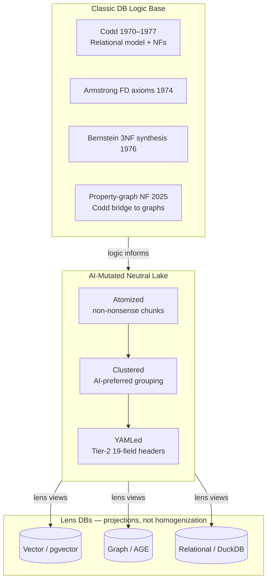

# Research Capture — AI Data Lake Structure (Primary)

**Purpose:** Capture architect thesis on **classic DB logic → AI-mutated lake file structure → lens databases**. Phoneme/accent normalization is a separate secondary thread — referenced in Section F queue only.

---

## Section A — Architect thesis (PRIMARY hierarchy)

Plain-language restatement. Status reflects inbox encoding today.

| Layer | Architect intent | Status |
|-------|------------------|--------|
| **1. Classic DB logic base** | Understand 50s/60s/80s/90s relational foundations (Codd, normal forms, FDs, Armstrong, Bernstein) as **logic base** — not to copy verbatim, but to inform structure. | **needs research** — cited in prior phoneme run; no Codd→AI bridge doc |
| **2. AI mutation of foundation** | Mutate classic math **purely for AI**: lake files must be **atomized**, **clustered**, **YAMLed**. | **partially encoded** — 19-field YAML + chunks taxonomy; clustering prototype in `lake_pipeline.py`; atom validity rubric missing |
| **3. Data lake = neutral storage** | Lake holds data without homogenizing; schema-on-read; raw reservoir upstream of specialised consumers. | **partially encoded** — `/archive/`, medallion prior-art bundle; Dixon 2010 framing ratified in synthesis |
| **4. Lens databases on top** | Vector, graph, relational DBs are **specialised views/projections** through which you look at lake data — multi-purpose without homogenization. | **partially encoded** — assertion-context boundary in `ai_native_data_organization.md`; multi-DB projection not wired |

### Priority hierarchy (architect correction 2026-06-30)

1. **PRIMARY:** Database structure — classic foundations → AI lake file shape → lens DBs  
2. **SECONDARY:** Phoneme/accent deterministic normalizer (3 touchpoints) — see `RESEARCH-CAPTURE__phoneme-atomization-lake__*`

### Architecture diagram

---

## Section B — Old-school foundations map

Classic relational theory anchors. **Use as logic base; construction is AI-specific.**

| Era | Concept | Key work | Citation | Relevance to lake |
|-----|---------|----------|----------|-------------------|
| 1970 | Relational model | Codd, "A Relational Model of Data for Large Shared Data Banks" | doi:10.1145/362384.362685 | Tables as mathematical relations → atoms as typed tuples with FD constraints |
| 1971 | Further normalization (1NF→3NF path) | Codd, "Further Normalization of the Data Base Relational Model" | doi:10.1145/362693.362698 | Decompose redundancy → atom boundaries; each chunk should carry single semantic dependency |
| 1974 | FD inference axioms | Armstrong (reflexivity, augmentation, transitivity) | Armstrong 1974; structure paper doi:10.1145/2422.322414 | Validate atom field dependencies; closure tests for schema evolution |
| 1976 | 3NF synthesis algorithm | Bernstein, "Synthesizing third normal form relations from functional dependencies" | doi:10.1145/320493.320489 | Algorithmic schema decomposition → automated atom split rules |
| 1977 | MVD / 4NF | Codd, "Multivalued dependencies and a new normal form" | doi:10.1145/320557.320571 | Multi-valued fields in YAML headers → separate atom or linked child atoms |
| 1979 | Semantic extension (E/F model bridge) | Codd, "Extending the database relational model to capture more meaning" | doi:10.1145/320107.320109 | Entity semantics above flat relations → graph lens projection |
| 1979 | NF design complexity | Bernstein, "Computational problems related to the design of normal form relational schemas" | doi:10.1145/320064.320066 | Trade-off: full normalization vs AI retrieval latency |
| 2010 | Data lake coinage | Dixon, "Pentaho, Hadoop, and Data Lakes" | [blog 2010-10-14](https://jamesdixon.wordpress.com/2010/10/14/pentaho-hadoop-and-data-lakes/) | Raw reservoir; decide meaning later — **neutral storage** |
| 2021 | Lakehouse unification | Armbrust et al., CIDR lakehouse paper | [cidr_lakehouse.pdf](https://people.eecs.berkeley.edu/~matei/papers/2021/cidr_lakehouse.pdf) | ACID metadata over object store; Parquet substrate |
| 2025 | Property-graph normal forms | "Third and Boyce–Codd normal form for property graphs" | doi:10.1007/s00778-025-00902-2; [VLDB P3031](https://www.vldb.org/pvldb/vol16/p3031-link.pdf) | **Codd→graph bridge** — directly maps to AGE lens atoms |

**Demoted this pass:** GeeksforGeeks BCNF explainers, YouTube normalization tutorials, Scribd mirrors where ACM primary exists.

---

## Section C — AI mutation layer (atomized + clustered + YAMLed)

What each property means and what research remains.

### C.1 Atomized — chunk size; each atom non-nonsense

| Aspect | Definition (architect) | Internal encoding | Research needed |
|--------|------------------------|-------------------|-----------------|
| **Size** | Token/line-bounded slices; not arbitrary byte splits | `chunks/` max ~300 lines; `lake_pipeline.py` token counts | Calibrate atom size vs embedding model context (late-chunking literature) |
| **Non-nonsense gate** | Atom must carry coherent semantic unit; garbage atoms useless downstream | 19-field schema + ingestion validation loop (§7–8 `ai_native_data_organization.md`) | **Atom validity rubric** — FD-inspired: single subject, no orphan pronouns, min information content |
| **Identity** | Stable IDs + hashes | SHA-256 chunk hash, BLAKE3 in prior-art bundle | Canonical ID joins across lens DBs |

**SearXNG survivors:** hierarchical RAG chunking (arxiv 2507.09935); parent-child retriever (LanceDB blog); late chunking (arxiv 2409.04701 — embed whole doc then chunk).

**OpenAlex survivors:** Modular RAG framework (arxiv 2407.21059); HtmlRAG (doi:10.1145/3696410.3714546).

### C.2 Clustered — AI-preferred grouping (not homogenized)

| Aspect | Definition | Internal encoding | Research needed |
|--------|------------|-------------------|-----------------|
| **Semantic clusters** | Group related atoms for retrieval without merging content | `chunk_clusters` + `clusters` tables in `lake_pipeline.py` | Cluster algorithm choice: GraphRAG Leiden vs embedding k-means vs taxonomy folders |
| **Parent context** | Small retrieval units + large context units | Not encoded | Parent-child chunk pattern (Small-to-Big); LanceDB parent-document retriever |
| **Community structure** | Higher-order summaries over clusters | GraphRAG prior-art (Edge et al. 2024) | Ollama GraphRAG extraction loop in data-lake synthesis — cite, don't re-research |

**SearXNG survivors:** GraphRAG hierarchical community retrieval (arxiv 2603.05207, 2502.09891); Active Data Lakes physical data independence (VLDB P1372).

**OpenAlex survivors:** GraphRAG survey (arxiv 2501.00309); Graph RAG survey (arxiv 2408.08921).

### C.3 YAMLed — formatted exactly as AI would like to read

| Aspect | Definition | Internal encoding | Research needed |
|--------|------------|-------------------|-----------------|
| **Tier 1 vs Tier 2** | Human-scannable vs AI-logic metadata | Dual-YAML paradigm in `ai_native_data_organization.md` | Field ordering stability for prompt caching |
| **19-field sovereign seal** | Programmatic coordinates, hashes, scopes | Blocks A–E in spec §3 | Extend for cluster_id, parent_atom_id, lens_projection flags |
| **Front-matter standard** | YAML header on every chunk file | `chunks/README.md` §2; chunk `.txt` files | Compare YAML vs JSON Schema vs TOON for LLM token efficiency |

**SearXNG survivors:** "Beyond JSON: Picking the Right Format for LLM Pipelines" (Medium); AI-assisted JSON Schema (arxiv 2508.05192); Front-Matter YAML standard (SteakHouse blog); Structured extraction Nature 2024 (OpenAlex doi:10.1038/s41467-024-45563-x).

**Demoted:** Reddit format debates, generic MightyBot prompt-format marketing.

### C.4 Atoms linked by label + chronology (architect insight 2026-06-30)

Thread re-extraction (`THREAD-EXTRACTION__atom-chunk-label-chronology__*`) crystallizes the **ideal atom link model** — flexible, not rigid schema.

| Dimension | Spec (INTUITED) | Internal encoding | Research needed |
|-----------|-----------------|-------------------|-----------------|
| **Primary links** | Multi-valued **labels** (category, document_type, epistemic_tier, domain, tags) + **chronology** (date, chunk_index, prev/next atom, version lineage) | Category folders in `chunks/`; 19-field partial; `extract_and_chunk.py` prev/next proto | **Label taxonomy registry**; **chronology field spec**; promote prev/next to 19-field v2 |
| **Secondary links** | Cluster membership, graph `parent_nodes`, content hash | `chunk_clusters`; UUID5 symlinks | Cluster algorithm eval |
| **Not required** | Rigid FK join schema across all atoms | — | Architect explicitly rejected over-normalization |
| **Size target** | ~800–1500 tokens analysis chunks; ~300 line cap; semantic boundary splits | `intelligence-lake.mdc`; `lake_pipeline.py` token counts | Late-chunking eval (arxiv 2409.04701) |
| **Identity** | `atom_id` + `chunk_hash_sha256` (+ optional BLAKE3) | 19-field fields 12–13 | Lens projection join keys |

**Prior art (label+chronology):** event sourcing (Azure); bi-temporal KG (MDPI 2025); RDF-star reification; tag-based metadata (JYU); Vellum append-only hash chain; RFC 4287 Atom syndication (name collision only).

**19-field v2 extensions (proposed):** `prev_atom_id`, `next_atom_id`, `tags[]`, `cluster_ids[]`, `bronze_source_id`, `atom_validity_score`.

Full extraction: `THREAD-EXTRACTION__atom-chunk-label-chronology__v01__2026-06-30__cursor.md`.

---

## Section D — Lens DB pattern (multi-DB from neutral lake)

**Thesis:** Databases on top of the lake are **lenses** — specialised projections, not homogenized copies.

| Lens | Role | Fleet target | Lake join key |
|------|------|--------------|---------------|
| **Vector** | Similarity retrieval over atom embeddings | Brain pgvector; `.vector` sidecars in chunks/ | `chunk_id` + `chunk_hash_sha256` |
| **Graph** | Entity/relation assertions only (no body text) | AGE / `/brain/entities/` | `parent_nodes` UUID5 symlinks |
| **Relational** | Operational queries, lineage, cluster membership | DuckDB `intelligence_lake.db` | `documents.id`, `chunks.id`, `chunk_clusters` |

### Prior art — polyglot persistence as lens pattern

| Source | Citation | Relevance |
|--------|----------|-----------|
| Polyglot persistence (Fowler-era pattern) | Dremio wiki; metapatterns.io | Multiple DB types for different access patterns — **same logical data, different lenses** |
| PDDM: Database Design Method for Polyglot Persistence | OpenAlex W3118609515; [ASRJETS PDF](https://asrjetsjournal.org/American_Scientific_Journal/article/download/6097/2209/18459) | Formal design method — map to lake→lens projection rules |
| Multi-Model Databases | doi:10.1145/3323214 (OpenAlex 2019) | Single engine, multiple models — alternative to true polyglot |
| Active Data Lakes: Regaining Physical Data Independence | [VLDB P1372](https://www.vldb.org/pvldb/vol19/p1372-ginter.pdf) | **Lens abstraction over lake** — directly supports architect "look through" metaphor |
| Assertion-Context Boundary | `ai_native_data_organization.md` §6 | Graph/vector store assertions; filesystem WAL holds full text — **already encoded doctrine** |

**Gap:** No production wiring from neutral lake Parquet/Silver to Brain pgvector + AGE + DuckDB on shared canonical IDs. Multi-DB projection map is **GAP UNRESOLVED**.

---

## Section E — Internal prior art

| Path | What it covers | Gap vs primary thesis |
|------|----------------|----------------------|
| `docs/ai_native_data_organization.md` | Dual-YAML; 19-field atom schema; assertion-context boundary; `/archive/` lake; ingestion gate | **Core encoded** — missing cluster fields, lens projection flags, atom validity rubric |
| `chunks/README.md` | Filesystem lake taxonomy (doctrine/rules/research/…); YAML headers; `.vector` sidecars | **Clustered by category** — not semantic GraphRAG clusters |
| `harness/lake_pipeline.py` | DuckDB `intelligence_lake.db`: documents, chunks, chunk_clusters, clusters, reasoning_primitives | **Prototype lens DB** — local sandbox; not wired to Beast MinIO Silver |
| `prior-art-syntheses-bundle/data-lake-prior-art-synthesis__*__2026-06-25.md` | Dixon 2010; Armbrust lakehouse; medallion Bronze/Silver/Gold; BLAKE3/MinHash; WhisperX; GraphRAG extraction loop | **Cite only** — do not re-research medallion substrate |
| `harness/gatekeeper.py` | References `intelligence_lake.db` for gate checks | Operational hook exists |
| `RESEARCH-CAPTURE__phoneme-atomization-lake__*` | Secondary thread — phoneme normalizer, dual-stream Bronze/Silver | **Deprioritized** — phonetic keys layer on top after structure ratified |
| `intelligence-lake.mdc` | — | **Not found** in repo (GAP — encode rule or locate on Beast) |

### Medallion mapping (from prior synthesis — cite, don't re-research)

| Layer | Lake role in architect model |
|-------|------------------------------|
| Bronze | Raw drops — neutral, append-only |
| Silver | Atomized + YAMLed files — **AI-mutated lake file structure lives here** |
| Gold | Ephemeral extraction to brain — lens DB materialization |

---

## Section F — Master research queue (prioritized)

**DB structure first. Phoneme second.**

| P | Item | Blocks | Owner |
|---|------|--------|-------|
| **P0** | **Atom ideal spec v1 ratification** — label taxonomy + chronology fields + link model | All lake work | ewan + cursor |
| **P0** | **Label taxonomy registry** — canonical enums + multi-valued tags (merge chunks/ + 19-field) | Label linking | cursor |
| **P0** | **Chronology field spec** — mandatory vs optional; prev/next pattern; wire from `extract_and_chunk.py` | Chronology linking | cursor |
| **P0** | **Codd→AI atom mapping doc** — 1 page: FDs → 19-field constraints; Bernstein decomposition → chunk split rules | All schema work | scribe + cursor |
| **P0** | **Atom validity rubric** — non-nonsense gate (semantic unit test before Silver promotion) | Atomized property | cursor |
| **P0** | **Lens projection map** — canonical IDs joining lake Parquet/Silver → vector/graph/relational lenses | Multi-DB architecture | cursor |
| **P1** | **Cluster algorithm eval** — taxonomy folders vs GraphRAG Leiden vs embedding clusters on inbox corpus | Clustered property | cursor |
| **P1** | **19-field schema v2** — add `prev_atom_id`, `next_atom_id`, `tags[]`, `cluster_ids[]`, `bronze_source_id`, `lens_flags`, `atom_validity_score` | YAMLed + label/chronology links | cursor |
| **P1** | **Parent-child chunk pattern** — Small-to-Big retriever; late chunking (arxiv 2409.04701) eval | Atom size calibration | cursor |
| **P1** | **Property-graph 3NF applied to AGE atoms** (doi:10.1007/s00778-025-00902-2) | Graph lens normal form | devin |
| **P1** | **YAML vs JSON Schema token efficiency** for Tier-2 headers | YAMLed property | cursor |
| **P2** | **PDDM polyglot persistence method** mapped to fleet lens set | Lens DB formal design | cascade-mac |
| **P2** | **Active Data Lakes lens abstraction** (VLDB P1372) — physical data independence over Silver | Architecture ratification | scribe |
| **P2** | DuckDB medallion fork (`datatomas/duckdb-medallion`) for local Silver Parquet | Lake file substrate | cursor |
| **P2** | Encode `intelligence-lake.mdc` rule or locate Beast SSOT | Harness gap | cursor |
| **P3** | Architect ratify medallion Bronze/Silver/Gold map (open from 2026-06-25 synthesis) | Beast implementation | ewan |
| — | *(Secondary)* Phoneme normalizer, dual-stream, Double Metaphone | See phoneme capture §E | cursor |

---

## SearXNG pass log (this run)

**Wide 1 (5):** Codd/Armstrong FDs; data lake atomization; YAML/LLM formats; polyglot persistence; RAG chunk clustering.

**Narrow (8):** Armbrust lakehouse CIDR; Bernstein 3NF synthesis; GraphRAG community; schema-on-read Parquet; PDDM polyglot; late chunking; property-graph 3NF; duckdb-medallion.

**Wide 2 (4):** KG entity normalization; neutral lake + specialised DBs; hierarchical chunking (0 results — demote query); YAML metadata headers.

**Demoted:** GeeksforGeeks, YouTube, Reddit threads, Scribd, generic Medium lake guides, HarperDB anti-polyglot polemic.

---

## OpenAlex pass log (this run)

| Query anchor | Top survivor |
|--------------|--------------|
| Codd normalization | Multivalued dependencies (1977) doi:10.1145/320557.320571 |
| Armstrong axioms | Structure of Armstrong relations (1984) doi:10.1145/2422.322414 |
| Bernstein 3NF | Synthesizing 3NF (1976) doi:10.1145/320493.320489 |
| Medallion / schema-on-read | AI-ready pipelines review (2022) doi:10.63125/51kxtf08 |
| Polyglot persistence | Multi-model migration (2022) doi:10.3390/app12126189 |
| RAG hierarchical chunking | Modular RAG (2024) arxiv:2407.21059 |
| GraphRAG | GraphRAG survey (2024) arxiv:2501.00309 |

---

## Cross-reference

- **Thread extraction (atoms):** `THREAD-EXTRACTION__atom-chunk-label-chronology__v01__2026-06-30__cursor.md` — label+chronology link model
- **Secondary (phoneme):** `RESEARCH-CAPTURE__phoneme-atomization-lake__v01__2026-06-30__cursor.md` — priority correction note added there
- **Prior synthesis (cite only):** `prior-art-syntheses-bundle/data-lake-prior-art-synthesis__*__2026-06-25.md`
- **Architect source:** thread 0e0bd954 (priority correction 2026-06-30)

---

## Section G — Imagineering falsification (SearXNG counter-evidence)

> **Architect note:** Imagineering — validate foundations or discard.

**Method:** For each architect foundation claim, run disprove query on `search.beast.amplifiedpartners.ai`; pair best counter URL with best supporting URL from this capture + pass log. Verdict = survive falsification attempt?

| Claim | Counter-evidence URL | Supporting URL | Verdict |
|-------|---------------------|----------------|--------|
| Codd normal forms = valid **logic base** for AI storage | [Why Data Lakes never become a real Data Analysis Platform](https://medium.com/codex/why-data-lakes-never-become-a-real-data-analysis-platform-9782e59f1ce2) — schema-on-read lakes defer structure; normalization framed as warehouse concern | [Property-graph 3NF/BCNF (VLDB 2023)](https://www.vldb.org/pvldb/vol16/p3031-link.pdf) — Codd extended to graph lens; [Aalto 2024 normalization + schema versioning PDF](https://aaltodoc.aalto.fi/bitstreams/ec2eedb7-253e-4f2f-96a6-a5ad574e9b41/download) | **SOLID** — as *informing* logic (FDs → atom boundaries), not as lake-wide 3NF enforcement |
| YAML optimal for AI read/write | [LLM Output Formats: JSON costs more than TSV](https://david-gilbertson.medium.com/llm-output-formats-why-json-costs-more-than-tsv-ebaf590bd541); [TOON vs JSON vs YAML token comparison](https://www.piotr-sikora.com/blog/2025-11-29-toon-format-comparison-csv-json-yaml) — structured text formats all suboptimal vs columnar/TSV for tokens | [Replace JSON with YAML in LLM prompts](https://www.linkedin.com/posts/charlywargnier_tip-replace-json-with-yaml-in-your-llm-activity-7375464271415095296-DBaO) — practitioner counter to counter | **WEAK** — "optimal" falsified; Tier-2 headers defensible as human+AI scannable, not token-minimal |
| Atomized chunks = correct retrieval unit | [Your Chunks Failed Your RAG in Production](https://towardsdatascience.com/your-chunks-failed-your-rag-in-production/) — bad splits dominate failure mode; [chunking is hard (Reddit)](https://www.reddit.com/r/AI_Agents/comments/1rlc2sv/why_is_chunking_so_hard_in_rag_systems/) | [Late chunking (arxiv 2409.04701)](https://arxiv.org/abs/2409.04701); [Modular RAG framework (arxiv 2407.21059)](https://arxiv.org/abs/2407.21059) | **SOLID** — unit correct; **GAP** on atom validity rubric (size/gate not calibrated) |
| AI clustering beats medallion tiering | [Lance v2.2 benchmarks — flat columnar efficiency](https://www.lancedb.com/blog/lance-format-v2-2-benchmarks-half-the-storage-none-of-the-slowdown); [Nested Parquet scan efficiency PDF](https://db.in.tum.de/~rey/papers/nestedparquet_rey.pdf) | [GraphRAG hierarchical retrieval (LanceDB)](https://www.lancedb.com/blog/graphrag-hierarchical-approach-to-retrieval-augmented-generation); [GraphRAG survey (arxiv 2501.00309)](https://arxiv.org/abs/2501.00309) | **WEAK** — not either/or; medallion = storage tiers, clustering = retrieval grouping; architect model uses both (§E) |
| Lens DBs avoid homogenization | [Polyglot persistence — is it worth it? (Dataversity)](https://www.dataversity.net/articles/utilizing-multiple-data-stores-data-models-polyglot-persistence-worth/); [Polyglot or not? (Reddit)](https://www.reddit.com/r/AskComputerScience/comments/1on9rhh/polyglot_persistence_or_not_polyglot_persistence/) — ops complexity real | [Active Data Lakes — physical data independence (VLDB P1372)](https://www.vldb.org/pvldb/vol19/p1372-ginter.pdf); assertion-context boundary (`ai_native_data_organization.md` §6) | **WEAK** — concept sound; polyglot ops cost + [vector swamp risk](https://www.himmelbauer-it.at/from-data-swamp-to-vector-swamp-why-ai-wont-fix-your-governance/) without governance |
| Lake + lens separation architecturally sound | [What Went Wrong with Data Lakes? 15-year field reality check (arxiv 2606.08266)](https://arxiv.org/pdf/2606.08266); [Draining the Data Swamp (ACM)](https://dl.acm.org/doi/10.1145/3209900.3209911) | [Dixon 2010 data lake coinage](https://jamesdixon.wordpress.com/2010/10/14/pentaho-hadoop-and-data-lakes/); Active Data Lakes P1372 (lens abstraction) | **GAP** — pattern ratified in literature; fleet lens projection map unwired (§D gap); swamp failure = governance not separation |

### Verdicts summary

| Verdict | Claims |
|---------|--------|
| **SOLID** (keep) | Codd as logic base; atomized chunks as unit (with rubric gap) |
| **WEAK** (reframe, don't discard) | YAML "optimal" → scannable Tier-2; clustering vs medallion → complementary; lens DBs → sound metaphor, heavy ops |
| **GAP** (concept OK, implement missing) | Lake+lens separation — literature supports; Amplified wiring + governance absent |

**Imagineering outcome:** Foundations are **not nonsense**. Discard: YAML-as-optimal, clustering-replaces-medallion. Keep with work: FD-informed atoms, medallion+clusters, lens projections with anti-swamp governance.

---

*Author: cursor · Epistemic tier: INTUITED · 2026-06-30*
