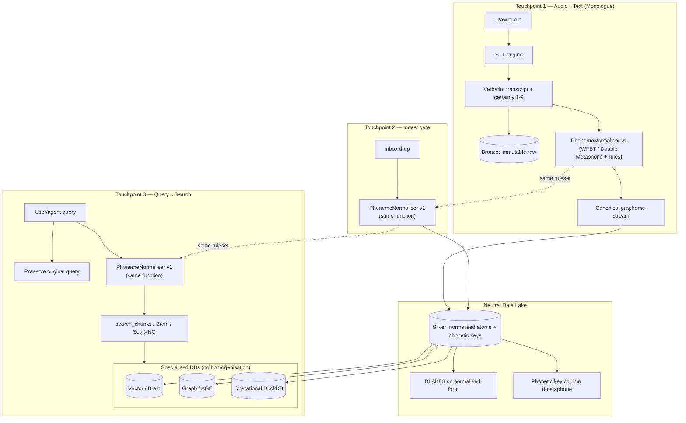

## Human summary

Consolidated three research passes on **deterministic phoneme normalizer at three touchpoints** (Monologue audio→text, ingest→lake, query→search). Internal work covers medallion lake, 19-field atom schema, and **grapheme-only** query autocorrect — **no phoneme spine encoded**. Tension: `overallpicture1` Verbatim Acoustic Intake Valve (preserve typos/false starts) vs canonical keys — **resolve via dual-stream Bronze verbatim + Silver normalized keys**. SearXNG survivors cluster on WFST G2P, morpheme decomposition, EDC canonicalization, property-graph 3NF, DuckDB medallion. Pass 3 resolved architect "xarviv" → **OpenAlex** (academic archive) + **Common Crawl** (web archive); added Mlphon FST G2P, Fellegi-Sunter blocking, FastCorrect dual-POV. **GAP UNRESOLVED:** failure-pattern corpus not inventoried. Full capture: `RESEARCH-CAPTURE__phoneme-atomization-lake__v01__2026-06-30__cursor.md`. Next: atom schema spec + 50-utterance prototype gate.

## Orchestrator payload

### meta

```yaml
run_id: phoneme-deterministic-normalizer-2026-06-30
stage: swanson_combine
corpus_item_id: phoneme-deterministic-normalizer-2026-06-30
epistemic_tier: INTUITED
pass_1_agent: 1f9920af (internal grep + WebSearch academic anchors)
pass_2_agent: 7a3e928f (SearXNG wide→narrow→wide, 20 queries)
pass_3_agent: df5da61b (capture doc + OpenAlex + Common Crawl + 7 SearXNG gap queries)
searxng: search.beast.amplifiedpartners.ai
openalex: api.openalex.org (6 queries — academic archive engine)
common_crawl: index.commoncrawl.org CDX (web archive engine probe)
archive_engine_note: "xarviv" in architect STT = no fleet executable; resolved to OpenAlex + Common Crawl
mac_supplement: pass 1 WebSearch for Codd/Armstrong/Double Metaphone/NeMo ITN/Fellegi-Sunter
```

### Internal encoded prior art (pass 1 — not in SearXNG-only run)

| Path | What it covers | Gap vs thesis |
|------|----------------|---------------|
| `harness/search_autocorrect.py` | Levenshtein + alias map → canonical vocab at **touchpoint 3 (query)** | **Grapheme edit distance, not phoneme** |
| `harness/lake_pipeline.py` | DuckDB `intelligence_lake.db`; documents/chunks/clusters | Local lake prototype; no phonetic key column |
| `docs/ai_native_data_organization.md` | **19-field AI-facing atom schema**; `/archive/` lake; non-destructive classification | Atomization at metadata level; no sound layer |
| `prior-art-syntheses-bundle/data-lake-prior-art-synthesis__human__v01__2026-06-25.md` | Dixon 2010; Armbrust lakehouse; medallion; BLAKE3/MinHash; WhisperX audio→Silver | Byte/near dedup — **not phoneme-aware** |
| `chunks/README.md` | Filesystem data-lake taxonomy (doctrine/rules/research/…) | AI-native chunk atoms; no phoneme keys |
| `scripts/search_chunks.py` | Chunks search CLI; hooks `search_autocorrect` | Search pyramid entry only |
| `Amplified-Partners/Research/overallpicture1-28-06-26 .txt` §7315+ | **Verbatim Acoustic Intake Valve** — preserve false starts, certainty 1–9; rejects human-centric normalization | **Conflicts** with 3-touchpoint normalizer unless layered |

**Not found in inbox:** `intelligence-lake.mdc`; phoneme/atomization RESEARCH-PIPE-RUN prior to this file; `process_brain/` unreachable from Mac workspace.

### Tension to resolve

| Stream | Preserves | Use |
|--------|-----------|-----|
| **Bronze** | Verbatim transcript (typos, false starts, certainty flags) | Satisfies Verbatim Acoustic Intake Valve; immutable provenance |
| **Silver** | Normalized grapheme + phonetic keys (`dmetaphone`, WFST output) | BLAKE3 dedup, search join, multi-DB projection |

**Recommendation:** dual-stream — same `PhonemeNormaliser v1` ruleset at all three touchpoints; Bronze never overwritten; Silver holds canonical atoms only. LLM interpretation sits **above** the normalizer, not inside dedup keys.

### Academic anchors (pass 1)

| Domain | Anchor | Citation |
|--------|--------|----------|
| Relational normal forms | Codd, "Further Normalization of the Data Base Relational Model" | 1971 |
| FD inference | Armstrong axioms (reflexivity, augmentation, transitivity) | Armstrong 1974 |
| Deterministic phonetic keys | Soundex; Metaphone; **Double Metaphone** (Philips) | 1918–2000 |
| ASR ITN (deterministic) | Zhang et al., NeMo WFST ITN (Pynini) | Interspeech 2021 |
| Entity resolution | Fellegi & Sunter record linkage theory | 1969 |

### SearXNG survivors (pass 2 — 20 queries)

**Wide 1 (5):** phoneme grapheme normalization deterministic; data lake atomization schema AI readable; relational normalization Codd third normal form; deterministic entity canonicalization knowledge graph; accent-invariant speech recognition G2P grapheme-to-phoneme.

**Narrow (8):** morpheme phoneticization grapheme-to-phoneme; phoneme-aware tokenization speech text; weighted finite-state transducer grapheme-to-phoneme normalization; schema-on-read medallion bronze silver atomization; Extract Define Canonicalize LLM knowledge graph EMNLP; entity resolution canonicalization OpenKG link prediction; SAT-Graph temporal knowledge graph canonical primitive. *(OLaPh demoted — 0 results.)*

**Wide 2 (7):** WFST grapheme-to-phoneme open source toolkit ACL; EDC Extract Define Canonicalize clear-nus github; CEKFA OpenKG canonicalization link prediction IJCAI; DuckDB parquet medallion bronze silver ingest pipeline; speech tokenization discrete units audio ingest lake; property graph third normal form database normalization; accent robust ASR phoneme normalization monologue transcription.

| id | Survivor | URL | Lane |
|----|----------|-----|------|
| S1 | WFST open-source G2P toolkit | https://aclanthology.org/W12-6208 | **Deterministic** grapheme→phoneme — strongest fit |
| S2 | Morpheme-based G2P (phonetic patterns) | https://dl.acm.org/doi/10.1145/595576.595580 | Unlimited-vocab; morpheme as atom unit |
| S3 | EDC: Extract, Define, Canonicalize (EMNLP 2024) | https://github.com/clear-nus/edc | Entity canonicalization for text atoms → graph |
| S4 | 3NF/BCNF for property graphs | https://link.springer.com/article/10.1007/s00778-025-00902-2 | Codd normalization ↔ graph atomization |
| S5 | DuckDB medallion local lakehouse | https://github.com/datatomas/duckdb-medallion | Multi-DB query surface from neutral Parquet lake |
| S6 | Accent-invariant ASR (saliency-driven) | https://arxiv.org/html/2510.09528v1 | Accent robustness for Monologue ingest |

**Demoted:** generic data-lake marketing, YouTube tutorials, shallow explainers.

### Pass 3 additions (OpenAlex + Common Crawl + SearXNG gap-fill)

| id | Survivor | URL | Lane |
|----|----------|-----|------|
| A1 | Mlphon: Multifunctional G2P using FSTs | https://doi.org/10.1109/access.2022.3204403 | Modern deterministic G2P — complements W12-6208 |
| A2 | Blocking and Filtering for Entity Resolution | https://doi.org/10.1145/3377455 | Phonetic blocking without byte dedup |
| A3 | FastCorrect (NeurIPS 2021) | https://arxiv.org/abs/2105.03842 | Neural spelling correction — dual-POV vs deterministic |
| A4 | Codd multivalued dependencies / new NF | https://doi.org/10.1145/320557.320571 | Foundational NF for atom schema |
| A5 | NeMo WFST ITN (Interspeech 2021) | https://doi.org/10.21437/interspeech.2021-1571 | Ingest-time deterministic normalization precedent |
| A6 | Splink phonetic algorithms guide | https://moj-analytical-services.github.io/splink/topic_guides/comparisons/phonetic.html | Double Metaphone blocking patterns |

**Archive engine resolution:** grep found "xarviv" only in architect STT (`overallpicture1-28-06-26 .txt` L430). Fleet canonical: **OpenAlex** (L2 academic, indexes arXiv) + **Common Crawl** (L4 web archive, `research_pipe/backends/common_crawl.py` on Beast). Common Crawl CDX returned WARC index records for aclanthology.org (2024-02 crawl).

### Gap list (merged)

| Status | Gap |
|--------|-----|
| Encoded | Lake tiers, BLAKE3/MinHash dedup, 19-field atom metadata, query Levenshtein autocorrect, verbatim acoustic + certainty flags |
| Encoded but conflicting | Verbatim valve vs phoneme canonicalization — needs dual-stream |
| Not encoded | Single shared phoneme/grapheme normalizer function |
| Not encoded | Monologue real-time hook (touchpoint 1); ingest normalizer before BLAKE3 keying (touchpoint 2) |
| Not encoded | Phonetic blocking keys alongside byte hash (Double Metaphone / accent variants) |
| **GAP UNRESOLVED** | **Failure-pattern audio/text corpus** — Brain `_inbox-voice`, vault transcripts; referenced in thread, **not inventoried** |
| **GAP UNRESOLVED** | Unified phoneme-canonical join key across Monologue, lake Bronze atoms, search queries |
| **GAP UNRESOLVED** | WFST vs neural dual-POV for architect speech (WFST auditable; neural handles accent, non-deterministic) |
| **GAP UNRESOLVED** | Atom schema: phoneme spine + entity spine + provenance — no production spec |
| **GAP UNRESOLVED** | Multi-DB projection (Brain pgvector + DuckDB + AGE) keyed on same canonical IDs |

### Architecture — dual-stream Bronze/Silver + PhonemeNormaliser v1 at 3 touchpoints



**Design note:** Bronze keeps verbatim (acoustic valve); Silver + all matching use normalised atoms only. Do not re-research medallion/Whisper/DuckDB lake hook — cite `prior-art-syntheses-bundle/data-lake-prior-art-synthesis__*__2026-06-25.md`.

### Pass 2 dual-POV questions

| POV | Question |
|-----|----------|
| **Methodology** | WFST G2P (W12-6208) + morpheme decomposition as deterministic spine vs neural discrete speech tokens for Monologue |
| **Completeness** | Where phoneme key attaches in medallion flow: post-Whisper → pre-Unstructured atomization → EDC canonicalization → Brain/DuckDB |

### Pass 3 deliverables

1. **Atom schema sketch:** `{phoneme_seq, grapheme_span, morpheme_id, entity_canonical_id, source_hash, tier, dmetaphone_key}`
2. **Integration map:** Monologue paste → normalizer → Bronze Parquet → Silver graph-normalized atoms → multi-DB views
3. **Prototype gate:** 50 Monologue utterances; measure accent/spelling join recall across search queries
4. **Code probe:** `clear-nus/edc`, WFST G2P toolkit (W12-6208), `duckdb-medallion` for fork/adapt candidates
5. **Corpus inventory:** Brain `_inbox-voice` + vault transcripts as measured tuning set (blocks promotion past INTUITED)

### handoff

```yaml
next_stage: implement_or_ratify
architect_flags:
  - "Dual-stream Bronze/Silver resolves verbatim-vs-canonical tension — needs Ewan ratification"
  - "Failure-pattern corpus inventory is blocking gate for MEASURED tier"
  - "Epistemic floor INTUITED until 50-utterance prototype + corpus counts"
do_not:
  - promote epistemic tier from agent output
  - overwrite Bronze verbatim with normalized form
  - use prior synthesis prose as search input
  - re-research medallion/Whisper (already in inbox bundle)
```

---

*Author: cursor · Epistemic tier: INTUITED · Passes merged: 1f9920af + 7a3e928f + df5da61b · Capture: RESEARCH-CAPTURE__phoneme-atomization-lake__v01__2026-06-30__cursor.md · 2026-06-30*
